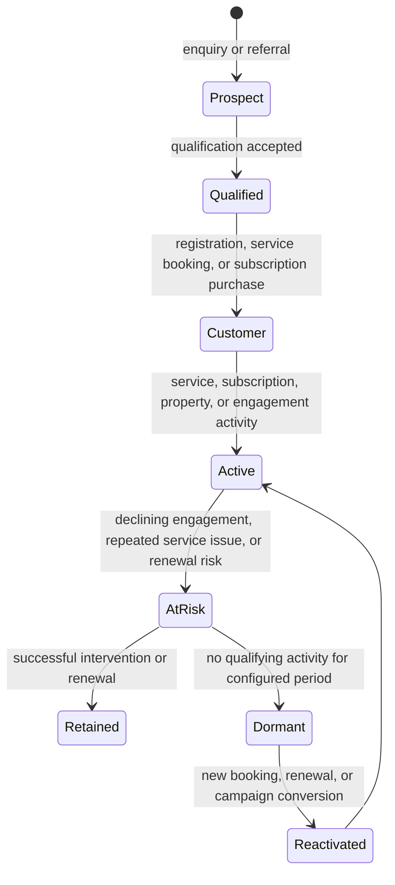

# PropertyPilot CRM Management

## Version

1.0

---

# Purpose

The CRM (Customer Relationship Management) module enables PropertyPilot to manage leads, opportunities, customer interactions, sales activities, follow-ups, conversions, and customer engagement.

---

# Objectives

The CRM module shall:

- Capture leads from multiple sources
- Track customer interactions
- Manage sales opportunities
- Automate follow-ups
- Improve lead conversions
- Track customer lifecycle
- Support quotation conversion
- Support service conversion
- Support subscription conversion
- Support future marketing automation

---
# CRM Lifecycle

Lead Created

↓

Lead Qualification

↓

Lead Assignment

↓

Customer Interaction

↓

Opportunity Creation

↓

Quotation

↓

Negotiation

↓

Conversion

↓

Service Delivery

↓

Customer Retention

---
# Lead Sources

PropertyPilot shall support lead generation from:

Website

Mobile App

Marketplace

Referral

Google Ads

Facebook Ads

WhatsApp

Phone Calls

Walk-In

Partner Network

Vendor Referrals

Agent Referrals

Manual Entry

Future Integrations

---
# Lead Information

Every lead shall contain:

Lead ID

Lead Number

Lead Source

Lead Type

Lead Name

Mobile Number

Email

Location

Interested Service

Budget

Priority

Assigned Executive

Lead Status

Created Date

Modified Date

---
# Lead Status

NEW

CONTACTED

QUALIFIED

UNQUALIFIED

FOLLOW_UP

INTERESTED

NOT_INTERESTED

CONVERTED

LOST

ARCHIVED

---
# Lead Priority

LOW

MEDIUM

HIGH

URGENT

---
# Lead Assignment

Leads may be assigned based on:

Location

Coverage Zone

Cluster

Workload

Service Category

Lead Source

Executive Availability

All assignment rules shall be configurable.

---
# CRM Activities

Track:

Phone Calls

WhatsApp Conversations

Emails

Meetings

Site Visits

Follow-Ups

Quotations

Service Discussions

Subscription Discussions

All activities shall be audit logged.

---
# Opportunity Management

Qualified leads may become opportunities.

Purpose:

Track revenue-generating prospects.

Fields:

Opportunity ID

Lead ID

Customer

Service Type

Expected Revenue

Probability

Expected Closure Date

Assigned Executive

Status

---
# Opportunity Status

OPEN

PROPOSAL_SENT

NEGOTIATION

APPROVAL_PENDING

WON

LOST

ON_HOLD

CANCELLED

---
# Sales Pipeline

Lead

↓

Qualified Lead

↓

Opportunity

↓

Quotation

↓

Negotiation

↓

Approval

↓

Conversion

↓

Service Request

↓

Customer

---
# Follow-Up Management

Every lead and opportunity shall support follow-ups.

Fields:

Follow-Up Date

Follow-Up Type

Remarks

Assigned User

Status

---
# Follow-Up Status

PENDING

COMPLETED

MISSED

RESCHEDULED

CANCELLED

---
# Revenue Tracking

Track:

Lead Revenue

Opportunity Revenue

Service Revenue

Subscription Revenue

Vendor Revenue

Conversion Revenue

Total Revenue

---
# Dashboard Metrics

Total Leads

Qualified Leads

Active Opportunities

Lead Conversion Rate

Opportunity Conversion Rate

Revenue Generated

Revenue Forecast

Top Lead Sources

Executive Performance

Follow-Up Compliance

---
# Integration Points

Integrates With:

Customer_Management.md

Service_Request.md

Quotation_Management.md

Subscription_Management.md

Marketplace_Management.md

Notification_Strategy.md

Analytics_Engine.md

Workflow_Engine.md

Audit_Management.md

---
# Audit Requirements

Track:

Lead Creation

Lead Updates

Lead Assignment

Opportunity Creation

Follow-Up Activities

Quotation Actions

Conversion Activities

Revenue Changes

Status Changes

---

Audit Fields

User

Timestamp

Action

Old Value

New Value

Reason

---
# Admin Configuration

Admin shall configure:

Lead Sources

Lead Statuses

Lead Scoring Rules

Assignment Rules

Follow-Up Rules

Reminder Rules

Pipeline Stages

Opportunity Rules

Revenue Rules

Notification Rules

No code deployment required.

---
# Future Enhancements

AI Lead Scoring

AI Lead Qualification

AI Sales Assistant

Predictive Conversion Analysis

Automated Follow-Ups

Customer Sentiment Analysis

Marketing Automation

Campaign Management

WhatsApp CRM

Voice CRM

AI Revenue Forecasting

Customer Lifetime Value Prediction

---

# Business Rules

1. Every lead shall have a unique Lead ID.

2. Leads shall support configurable qualification rules.

3. Opportunities shall be linked to leads.

4. Follow-up activities shall be tracked.

5. Lead assignment rules shall be configurable.

6. CRM activities shall be audit logged.

7. CRM shall support quotation and service conversions.

8. CRM data access shall be role-based.

9. CRM configuration shall not require code deployment.

10. CRM Management shall serve as the customer acquisition and sales management engine of PropertyPilot.

---

# Enterprise Customer Relationship Specification

The CRM is the relationship and engagement layer over the Customer Master, Property Management, Service Workflow, Subscription Management, Complaint Management, and Notification Strategy. It is not the system of record for service execution, payment settlement, or property evidence; it assembles authorised customer context from those domains into a controlled relationship view.

## Lead Management

CRM shall capture leads from the public website, mobile application, marketplace, referrals, campaigns, WhatsApp, calls, walk-ins, partners, vendors, agents, and manual entry. Every lead shall retain source, campaign/referral attribution, consent status, interested property/service/subscription, location, budget, priority, score, assignment, and status history.

Lead qualification shall evaluate service requirement, property/location eligibility, budget, ownership, timeline, decision-maker availability, engagement, and duplicate-match risk. Configurable scoring shall classify leads as Hot, Warm, or Cold and route work by location, coverage zone, cluster, service type, workload, and representative capacity.

A lead converts only when an authorised conversion event occurs: service request creation, subscription purchase, quotation approval, or marketplace transaction completion. Conversion must preserve the lead/customer linkage and source attribution; lost/unqualified reasons must be captured for analysis.

## Customer Lifecycle

Lifecycle status is calculated from business events and does not overwrite legal customer status, KYC status, property ownership, service-request state, or subscription state. The calculation rules, inactivity period, and at-risk triggers shall be administrator configurable.

## Prospect Management

Prospect management shall support anonymous price-calculator users, plan-comparison users, enquiries, property/marketplace leads, vendor/partner referrals, and pre-registration service prospects.

The CRM shall:

- Retain a consent-aware prospect record without creating a full customer master until registration or approved conversion.
- Associate estimates, selected service/property type, location, plan comparison, campaign, and follow-up activity with the prospect.
- Deduplicate against existing leads/customers by verified mobile number, email, or approved matching policy.
- Convert the prospect to a customer while preserving lead source, quote, interaction, and attribution history.

## Customer Segmentation

Customer segments shall be configurable and may combine:

- Lifecycle status, lead source, engagement score, preferences, consent, and referral relationship.
- Property count, property type, location, verification status, monitoring status, and shared-ownership role.
- Service history, service value, service category, recommendations, service-health score, and unresolved issues.
- Subscription plan, entitlement use, renewal date, auto-renewal setting, plan value, churn risk, and NRI status.
- Complaint/dispute history, satisfaction, rating, communication preference, and preferred channel/language.

Segments may drive dashboards, owner assignment, retention campaigns, reminders, and recommendation eligibility. Sensitive attributes may not be used for marketing without the required consent and policy approval.

## NRI Customer Management

CRM shall identify NRI customers and provide a dedicated remote-property relationship profile. It shall link NRI customers to authorised properties, monitoring plans, video reports, relationship-manager ownership, emergency-alert preference, time zone, preferred language/channel, and outstanding action items.

NRI communication shall prioritise property status reports, GPS/media evidence, video walkthroughs, monitoring issues, service recommendations, subscription renewal, vendor coordination, and emergency response. Access by relationship managers must be scoped to assigned customers/properties and fully audit logged.

## Customer Communication History

CRM shall provide a chronological, immutable customer interaction timeline covering in-app notifications, push, SMS, email, WhatsApp where enabled, calls, meetings, site visits, relationship-manager messages, quotation discussions, subscription discussions, and complaint communications.

Each entry shall include source event/activity, channel, template or content reference, direction, sender/recipient, delivery/read status where available, related customer/property/service/subscription/complaint/lead IDs, consent basis, correlation ID, and audit metadata. The timeline shall link to the Notification Service rather than duplicate its delivery source of truth.

## Follow-up Management

Follow-ups may be created from leads, prospects, customer actions, report recommendations, abandoned estimates, pending payment, subscription renewal, missed visits, complaints, quotations, marketplace enquiries, and service completion feedback.

| Status | Meaning |
|---|---|
| Pending | Follow-up is due in the future or awaiting action. |
| Completed | Assigned owner completed the required activity. |
| Missed | Due time passed without completion. |
| Rescheduled | Owner or workflow moved the due time with a reason. |
| Cancelled | Follow-up no longer applies and has a recorded reason. |

The system shall route reminders and escalations according to owner, lead/customer priority, SLA, quiet hours, consent, and configured channel. Completion notes and next action are mandatory for outcome-tracked follow-ups.

## Service History

The CRM service-history view shall aggregate authorised customer/property activity from the Service Workflow and Service Summary domains, including service request, service category, property, price/quote reference, payment state, assignment, ETA, lifecycle status, evidence/report/summary links, SLA outcome, recommendation, rating, and follow-up action.

It shall distinguish verification, inspection, monitoring, coordination, execution, maintenance, agriculture, construction, security, NRI, and premium services. CRM may display a service summary and next suggested service but must preserve the Service Workflow as the source of truth for execution status.

## Subscription History

The subscription-history view shall display plan, property, entitlement, activation, renewal, upgrade/downgrade, pause/resume, cancellation, expiry, billing/payment reference, visit consumption, report delivery, refund outcome, and next renewal action.

It shall support Silver, Gold, Platinum, NRI Elite, and NRI Concierge plan history; plan version and effective-date history must remain visible when a customer changes plan. Subscription state and billing status are read from Subscription Management and Billing services.

## Complaint History

CRM shall display authorised complaint/dispute records linked to the customer, property, service request, report, summary, subscription, quotation, vendor, agent, marketplace listing, payment, or refund. The view shall include category, priority, owner, SLA, status, evidence reference, resolution, appeal/reopen status, satisfaction feedback, and next action.

CRM users may create a follow-up from a complaint but may not alter investigation evidence, resolution approval, or refund state without the appropriate Complaint and Dispute Management permission.

## Customer 360 View

The Customer 360 view is an authorised composite view, not a replicated customer store. It shall contain:

- Customer identity, KYC/verification state, preferences, consent, communication language/channel, lifecycle/segment, and relationship owner.
- Property portfolio, ownership role, property status, verification/monitoring history, documents/media/report links, and property risk/action summary.
- Lead, prospect, opportunity, estimate, quotation, marketplace enquiry, referral, and follow-up history.
- Service, subscription, invoice/payment/refund, complaint/dispute, rating, recommendation, and engagement history.
- Current tasks, pending actions, upcoming visits, renewal dates, SLA risks, and authorised next-best-action recommendations.

The view shall enforce organisation, ownership, shared-property, assignment, and role scope on every component. Restricted financial, bank, vendor-internal, investigation, and security data must be masked or omitted by role.

## Customer Analytics

CRM analytics shall provide customer acquisition, engagement, conversion, service, subscription, support, and value metrics. Minimum metrics include lead volume/source, qualification/conversion rate, response/follow-up compliance, acquisition cost where available, estimate-to-booking conversion, service and subscription conversion, renewal/churn, ARPU, CLV, property/service mix, complaint rate/resolution time, satisfaction, referral performance, and channel action rate.

Analytics shall support filtering by organisation, region/cluster, property type, service type, segment, plan, lifecycle state, relationship owner, source, and date range. Reporting uses committed operational data and role-scoped aggregates.

## Retention Programs

Retention programs shall support segmented, consent-aware actions for renewal due, dormant customers, unconsumed subscription value, report-recommended services, property risk, repeat service, complaint recovery, and NRI relationship management.

Programs may deliver configured in-app, push, SMS, email, or WhatsApp messages where enabled. They shall record campaign/program, segment, eligibility, offer, channel, consent basis, delivery outcome, action/conversion, opt-out, and suppression reason. Critical service, payment, or safety communications remain separate from marketing opt-out rules.

## Referral Management

Referral management shall capture referrer, prospect/referee, referral source/campaign, associated service/property/plan, consent, qualification, conversion, reward eligibility, reward status, and fraud/duplicate checks.

Rewards may be discount, credit, service benefit, or configured incentive and shall be granted only after the defined qualifying event. The system shall prevent self-referral, duplicate referral, and reward issuance before confirmed conversion; referral attribution remains available throughout lead/customer history.

## Database Entities

| Entity | CRM role |
|---|---|
| `customers`, `customer_addresses` | Customer master, contact/location, lifecycle/segment references, and verified identity linkage. |
| `properties`, `property_documents` | Customer portfolio, ownership/property context, verification inputs, and document links. |
| Lead/opportunity/activity/follow-up records | CRM-owned acquisition, pipeline, assignment, activity, scoring, attribution, and task records; maintained in the CRM schema. |
| `services`, `service_requests`, `visits` | Service catalog context, booking/execution lifecycle, visit/ETA, and consumption history. |
| `evidence`, `reports` | Customer-facing proof, report, and service-summary references. |
| `subscription_plans`, `customer_subscriptions`, `subscription_renewals` | Plan, entitlement, lifecycle, renewal, and visit-consumption history. |
| `payments`, `invoices`, `refunds` | Customer commercial history and reconciliation/refund status. |
| `complaints`, `complaint_comments` | Support/dispute history, outcomes, and follow-up references. |
| `notifications`, `notification_templates` | Delivery history, template/event reference, preference, and engagement metrics. |
| `audit_logs` | Immutable history of CRM changes, sensitive access, assignment, consent, and conversion actions. |

All CRM records shall carry organisation scope, relationship references, common audit columns, retention policy, and appropriate privacy classification. Customer 360 read models shall be derived from authoritative services rather than become a separate transactional master.

## APIs

| Method | Endpoint | Function |
|---|---|---|
| POST/GET | `/leads` | Create or search role-scoped leads. |
| GET/PATCH | `/leads/{leadId}` | Retrieve or update lead qualification, status, or score. |
| POST | `/leads/{leadId}/assignments` | Assign or reassign a lead. |
| POST | `/leads/{leadId}/follow-ups` | Create a follow-up activity. |
| PATCH | `/follow-ups/{followUpId}` | Complete, reschedule, cancel, or record follow-up outcome. |
| POST | `/leads/{leadId}/convert` | Convert an eligible lead to customer, service, subscription, or marketplace context. |
| GET | `/customers/{customerId}/360` | Retrieve the authorised composite Customer 360 view. |
| GET | `/customers/{customerId}/communications` | Retrieve customer communication history. |
| GET | `/customers/{customerId}/service-history` | Retrieve service and report history. |
| GET | `/customers/{customerId}/subscription-history` | Retrieve subscription/entitlement history. |
| GET | `/customers/{customerId}/complaint-history` | Retrieve complaint/dispute history. |
| POST/GET | `/referrals` | Create or retrieve referral records. |
| GET | `/crm/segments` | Retrieve configured, authorised segments. |
| POST | `/crm/retention-programs/{programId}/execute` | Execute an approved, consent-aware retention program. |

All write APIs shall require role and organisation/ownership scope, idempotency where appropriate, correlation IDs, input validation, consent checks, and audit logging.

## Notifications

| Event | Recipients | Channel/priority rule |
|---|---|---|
| New lead or assignment | Assigned owner, manager where required | In-app/push; escalation when unacknowledged. |
| Follow-up due or missed | Assigned owner, manager on escalation | Reminder priority; respect quiet hours unless SLA-critical. |
| Estimate, quotation, booking, or payment action | Prospect/customer, assigned owner | Transactional channel based on consent/preference and event policy. |
| Service/report/recommendation ready | Customer, relationship owner where action is required | In-app/push/email; secure report links only. |
| Subscription renewal, failure, pause, or expiry | Customer, authorised operations owner | Subscription event policy; mandatory rules apply. |
| Complaint escalation or resolution | Customer, case owner, management as configured | Priority follows complaint severity/SLA. |
| Referral conversion or reward outcome | Referrer/referee where permitted | Marketing/transactional classification and consent enforced. |

Notification delivery, retries, deduplication, template use, preferences, quiet hours, and delivery tracking shall follow Notification Strategy rules.

## Dashboards

| Audience | Dashboard content |
|---|---|
| Relationship/sales user | Assigned leads, hot prospects, due/missed follow-ups, opportunities, conversions, estimated pipeline, customer action queue. |
| Customer success/retention user | At-risk/dormant customers, renewal calendar, unconsumed entitlement, report recommendations, complaints, satisfaction, retention-program results. |
| Operations user | Customer-service context, upcoming visits, SLA risks, issue alerts, escalations, unresolved complaint/service actions. |
| NRI relationship manager | Assigned NRI portfolio, monitoring/report cadence, emergency alerts, open actions, communication responsiveness, renewal risk. |
| Management/admin | Acquisition funnel, conversion/revenue, service/subscription adoption, churn/retention, CLV/ARPU, source/campaign/referral performance, quality and complaint trends. |

## MVP Scope

The MVP shall provide lead capture/qualification/assignment, basic lead scoring, follow-up tasks/reminders, customer conversion, customer profile and property linkage, service and subscription history, notification timeline, basic Customer 360, role-scoped dashboards, audit logging, and lead/service/subscription conversion reporting.

NRI relationship views, retention programs, referral workflows, advanced segmentation, vendor/marketplace CRM, and predictive analytics may be released after the core acquisition and service-conversion workflow.

## Future Enhancements

- AI lead scoring, qualification, next-best-action, retention/churn prediction, sentiment, and sales assistance.
- Automated multichannel follow-ups, WhatsApp/voice CRM, smart reminder scheduling, and multilingual relationship workflows.
- Real-time behavioural engagement scoring and journey orchestration across website, mobile, marketplace, services, and subscriptions.
- Customer lifetime-value prediction, dynamic offers, referral fraud detection, loyalty/reward programs, and campaign attribution optimisation.
- Privacy-preserving customer data platform capabilities, configurable consent management, and advanced household/family/shared-property relationship graphs.
