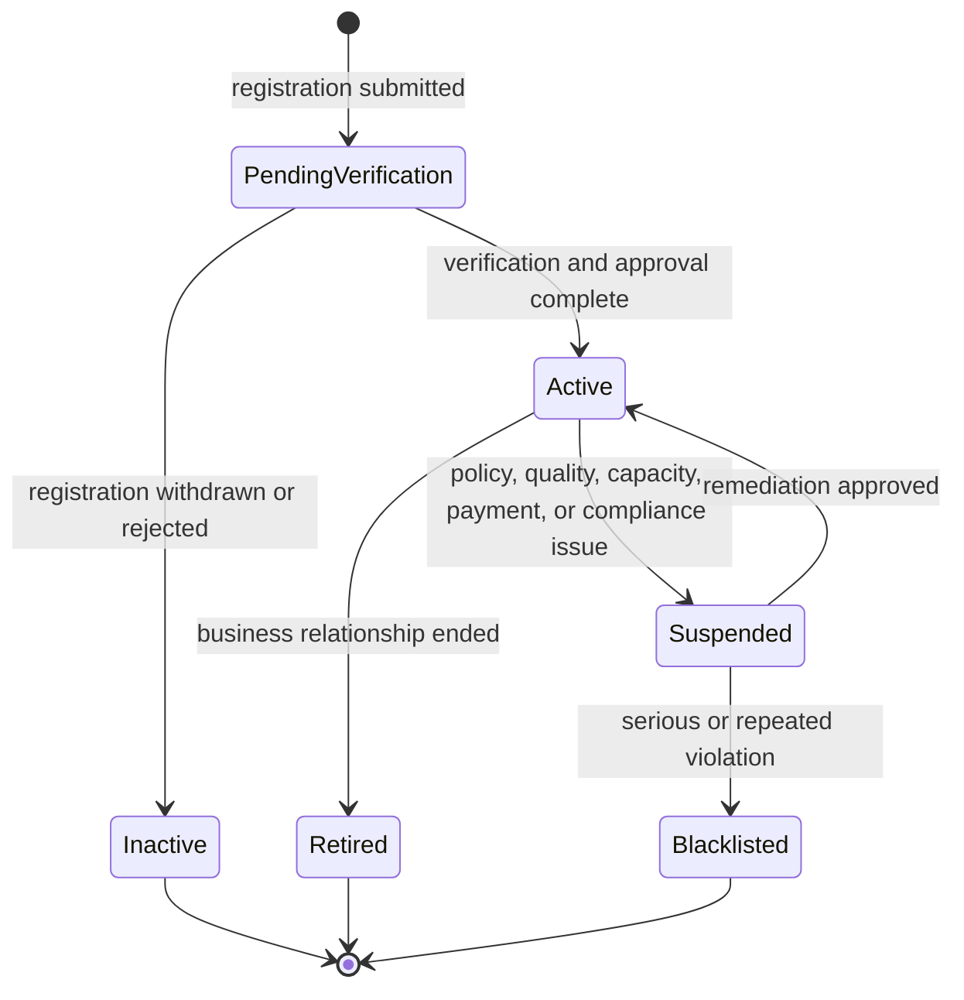

# PropertyPilot Vendor Management

## Version

1.0

---

# Purpose

The Vendor Management module enables PropertyPilot to onboard, manage, verify, assign, monitor, and evaluate vendors and contractors who provide execution-based services.

The module supports service expansion beyond inspections into property development, construction support, farm development, and contractor coordination.

---

# Objectives

The Vendor Management module shall:

- Manage vendors and contractors
- Support vendor verification
- Support vendor categorization
- Support vendor assignments
- Support vendor performance tracking
- Support quotation requests
- Support execution services
- Support future marketplace expansion

---
# Vendor Lifecycle

Vendor Registration

↓

Document Submission

↓

Verification

↓

Activation

↓

Assignment

↓

Quotation Participation

↓

Execution

↓

Performance Evaluation

↓

Rewards / Penalties

↓

Suspension / Deactivation

# Vendor Overview

Customer Request

↓

Site Assessment

↓

Vendor Selection

↓

Quotation

↓

Approval

↓

Execution

↓

Completion

↓

Feedback

---

# Vendor Types

## Construction Vendors

Examples:

- Compound Wall Contractor
- Precast Wall Contractor
- Mason Contractor
- Civil Contractor

---

## Agriculture Vendors

Examples:

- Farm Development Contractor
- Borewell Contractor
- Irrigation Contractor

---

## Site Development Vendors

Examples:

- Land Levelling
- Site Cleaning
- Fencing

---

## Property Maintenance Vendors

Examples:

- Cleaning Services
- Painting Services
- Repair Services

---

# Vendor Categories

CONSTRUCTION

AGRICULTURE

SITE_DEVELOPMENT

PROPERTY_MAINTENANCE

INFRASTRUCTURE

CONSULTATION

MULTI_SERVICE

---

# Vendor Registration

Vendor shall provide:

Vendor Name

Business Name

Contact Number

Email

Address

Coverage Areas

Services Offered

Bank Information

Identity Documents

GST Details (Optional)

License Information (Optional)

---

# Vendor Verification

Verification Levels

UNVERIFIED

BASIC_VERIFIED

VERIFIED

TRUSTED

PREMIUM_VENDOR
---

# Vendor Agreement Management

The system shall support:

Vendor Agreements

NDA Documents

Service Contracts

Rate Cards

Compliance Documents

Track:

Agreement Number

Start Date

End Date

Status

Renewal Date

Business Rules

Expired agreements may restrict assignments.
---

# Vendor Verification Checks

Identity Verification

Contact Verification

Bank Verification

Service Verification

Reference Verification

Document Verification

---

# Vendor Profile

Vendor ID

Vendor Name

Vendor Category

Coverage Areas

Services Offered

Verification Status

Rating

Availability

Performance Metrics

Status

---
# Vendor Team Management

Future Support

Vendors may operate through teams.

Track:

Team Size

Supervisors

Field Staff

Specialized Resources

Contract Workers

---

Team Status

ACTIVE

INACTIVE

SEASONAL

EXPANDED

REDUCED
---
# Vendor Status

PENDING_VERIFICATION

ACTIVE

INACTIVE

SUSPENDED

BLACKLISTED

RETIRED

---

# Coverage Management

Vendor shall support:

State

District

Mandal/Taluk

Village

Cluster

Radius Coverage
---

# Vendor Service Eligibility

Vendors may support specific services only.

Examples

Vendor A

Compound Wall

Precast Wall

Fencing

Vendor B

Borewell

Farm Development

Irrigation

Business Rules

Vendor assignment shall validate:

Coverage

Service Eligibility

Verification Status

Availability

Capacity
---

# Vendor Service Mapping

Examples

Compound Wall

↓

Eligible Vendors

---

Borewell

↓

Eligible Vendors

---

Farm Development

↓

Eligible Vendors

---

Guest House Construction

↓

Eligible Vendors

---

# Vendor Assignment

Assignments may be generated from:

Customer Request

Marketplace Lead

Construction Requirement

Development Service Request

Quotation Request

---

# Assignment Workflow

Request Created

↓

Vendor Shortlisted

↓

Vendor Assigned

↓

Vendor Accepts

↓

Execution Starts

↓

Execution Completes
---

# Project Execution Integration

Approved quotations may generate projects.

Vendor Responsibilities:

Project Acceptance

Resource Allocation

Execution Updates

Milestone Completion

Evidence Submission

Completion Confirmation

Integrates With:

Quotation_Management.md

Future Project_Management.md
---

# Vendor Availability

Support:

Available

Busy

On Leave

Unavailable

Emergency Only

---

# Vendor Performance Tracking

Track:

Total Assignments

Completed Assignments

Cancelled Assignments

Customer Ratings

Average Response Time

Completion Time

Revenue Generated

---
# Vendor Quality Assurance

Purpose

Ensure service quality and execution standards.

---

Review Areas

Work Quality

Execution Accuracy

Completion Standards

Safety Compliance

Customer Satisfaction

Documentation Quality

---

Quality Outcomes

APPROVED

REWORK_REQUIRED

REJECTED

ESCALATED
---

# Vendor Ratings

Rating Scale

1 - 5

---

Rating Factors

Quality

Timeliness

Communication

Professionalism

Pricing Satisfaction

---

# Vendor Trust Score

Future Support

Factors:

Verification Level

Completion Rate

Customer Ratings

Response Time

Dispute History

---
# Vendor Suspension Rules

Reasons

Repeated Customer Complaints

Fraudulent Activity

Poor Service Quality

Policy Violations

Fake Documentation

Repeated Project Failures
---

# Vendor Complaint Tracking

Track:

Total Complaints

Open Complaints

Resolved Complaints

Escalated Complaints

Complaint Rate

Complaint Severity

Business Rules

Complaint history may influence:

Vendor Rating

Trust Score

Assignment Eligibility

Verification Status
---

Actions

WARNING

TEMPORARY_SUSPENSION

PERMANENT_BLACKLIST
---

# Vendor Quotation Support

Vendor may:

Submit Quotations

Revise Quotations

Withdraw Quotations

Track Quotation Status

---

# Vendor Payments

Support:

Assignment Payments

Milestone Payments

Final Settlement

Performance Incentives

---

# Vendor Payout Status

PENDING

APPROVED

PROCESSING

PAID

FAILED

CANCELLED

---

# Vendor Notifications

Notify Vendor:

New Assignment

Quotation Request

Assignment Accepted

Assignment Cancelled

Payment Released

Performance Alerts

---

# Customer Visibility

Customers may view:

Vendor Name

Vendor Rating

Vendor Verification Status

Completed Projects

Service Coverage

---

Sensitive Information Hidden:

Bank Details

Internal Notes

Performance Flags
---

# Vendor Relationships

A vendor may be linked to:

Coverage Zones

Clusters

Service Categories

Quotations

Projects

Assignments

Payments

Complaints

Ratings

Marketplace Listings

Purpose:

Enable complete traceability across PropertyPilot modules.
---

# Vendor Analytics

Track:

Vendor Count

Active Vendors

Top Vendors

Vendor Revenue

Vendor Ratings

Service Coverage

Assignment Success Rate

---

# Vendor Dashboard

Vendor Dashboard shall provide:

Assignments

Quotations

Revenue

Ratings

Notifications

Performance Metrics

---

# Admin Dashboard

Admin shall view:

Vendor Performance

Coverage Gaps

Revenue Contribution

Verification Status

Assignment Statistics

---

# Marketplace Integration

Integrates With:

Marketplace_Management.md

Supports:

Seller Assistance

Property Development Services

Construction Services

Farm Development Services

---

# Quotation Integration

Integrates With:

Quotation_Management.md

Supports:

Quotation Requests

Quotation Approval

Quotation Tracking

---

# Security Integration

Integrates With:

Security_Design.md

Supports:

Vendor Verification

Access Control

Audit Logging

Document Security

---

# Audit Requirements

Track:

Registration

Verification

Assignments

Quotation Submission

Payment Events

Profile Changes

Status Changes

---

Audit Fields

User

Timestamp

Action

Old Value

New Value

Reason

---

# Admin Configuration

Admin shall configure:

Vendor Categories

Verification Rules

Coverage Rules

Assignment Rules

Rating Rules

Trust Score Rules

Payment Rules

No code deployment required.

---

# Future Enhancements

Vendor Marketplace

AI Vendor Matching

Vendor Trust Scores

Vendor Capacity Planning

Partner Network

Franchise Vendors

Multi-Vendor Quotations

Vendor Recommendation Engine

---
# Vendor Capacity

Vendor Capacity defines how much work a vendor can handle.

Examples:

Active Projects

Maximum Concurrent Projects

Available Teams

Workforce Size

Equipment Availability

Capacity Status

AVAILABLE

LIMITED

FULLY_BOOKED
---

Track:

Current Active Projects

Maximum Concurrent Projects

Available Workforce

Available Equipment

Upcoming Commitments

Utilization Percentage

Examples

Vendor Capacity = 20 Projects

Current Projects = 15

Utilization = 75%

Business Rules

Assignments shall consider vendor capacity before allocation.

Overloaded vendors may be excluded from new assignments.
---

# Vendor Status History

The system shall maintain vendor status history.

Track:

Previous Status

New Status

Changed By

Timestamp

Reason

Examples

ACTIVE → SUSPENDED

SUSPENDED → ACTIVE

ACTIVE → BLACKLISTED

All status changes shall be audit logged.

# Business Rules

1. Vendors shall be categorized.

2. Vendors shall support verification levels.

3. Vendor assignments shall be tracked.

4. Vendor performance shall be measurable.

5. Vendor ratings shall be supported.

6. Vendor activities shall be audit logged.

7. Vendor configuration shall not require code deployment.

8. Vendor Management shall support future execution services.

9. Vendor Management shall integrate with Marketplace and Quotation modules.

10. Vendor information shall be protected according to Security Design.

---

# Enterprise Vendor Operating Specification

This section defines the executable controls for vendors that deliver PropertyPilot services. It applies to suppliers, contractors, specialist service providers, and marketplace partners assigned to field inspection, coordination, execution, maintenance, construction, agriculture, security, NRI, and premium-service work.

## Vendor Lifecycle

Only `Active` vendors with a valid agreement, required verification level, service mapping, coverage, availability, and capacity may receive new assignments. A suspended, blacklisted, inactive, or retired vendor cannot be newly assigned.

## Vendor Registration

Vendor registration shall collect and validate:

- Legal/business name, trading name, primary contact, mobile number, email, and registered address.
- Vendor category, services offered, coverage area, supported property types, available workforce/equipment, and operating hours.
- Identity, business registration, tax/GST information where applicable, licence/certification, bank/payout details, insurance, references, and compliance documents.
- Service rate card, quotation validity rules, emergency/weekend availability, and acceptance of vendor agreement, NDA, and platform policies.

New registrations are created in `PendingVerification` status. Bank details and internal risk/compliance notes are restricted from customer and standard operations views.

## Vendor Verification

Verification shall assess identity, contact details, business registration, bank ownership, service capability, licence/certification, coverage, references, agreement, and required compliance documentation.

| Level | Minimum meaning | Assignment eligibility |
|---|---|---|
| Unverified | Registration received; checks incomplete. | Not eligible. |
| Basic Verified | Identity/contact and mandatory registration checks complete. | Eligible only for approved low-risk service types. |
| Verified | Business, service capability, bank, agreement, and required documents validated. | Eligible for standard mapped services. |
| Trusted | Verified vendor with satisfactory quality, delivery, and complaint history. | Eligible for priority assignments subject to capacity. |
| Premium Vendor | Trusted vendor approved for premium, emergency, or specialised work. | Eligible for mapped premium services, including configured drone/virtual services. |

Verification expiry, failed checks, document expiry, and changed bank details shall trigger re-verification and may suspend assignment eligibility.

## Vendor Approval

Vendor approval is a controlled administrative decision after verification completes. The approving authority shall review verification result, service mapping, coverage, rate-card/quotation policy, capacity, agreement status, and any risk or complaint flags.

Approval outcomes are `Approved`, `Rejected`, `More Information Required`, or `Approved with Restrictions`. Restrictions may limit a vendor by service, property type, geography, monetary threshold, project type, or maximum concurrent job count. The decision, approver, reason, effective date, and evidence references shall be audit logged.

## Vendor Categories

Vendor categories shall support the Service Catalog and may include:

| Category | Example mapped services |
|---|---|
| Verification and inspection | physical visit, boundary/road-access/encroachment inspection, structural, plumbing, electrical, flat and handover inspection |
| Construction and civil works | compound/precast/RCC walls, guest house, farm house, villa, commercial building, renovation, civil works |
| Property maintenance | plot cleaning, bush removal, painting, deep cleaning, pest control, flooring, false ceiling, bathroom renovation |
| Agriculture and land development | borewell, irrigation, soil/water testing, farm road, land clearing, tractor coordination, agriculture fencing |
| Security and monitoring | security visits, CCTV installation, vacant-property monitoring, illegal-activity/encroachment monitoring |
| Utilities and coordination | electricity/water connection assistance, borewell assistance, legal/document coordination |
| Premium media services | drone survey, photography/videography, virtual tour, live video walkthrough |

## Vendor Service Mapping

Each mapping shall bind a vendor to a service, property type, geography/cluster, execution model, required verification level, certification/skill, rate-card/quotation rule, SLA, availability, capacity, and effective date.

The assignment engine shall validate all active mappings before shortlisting. A mapping may be suspended independently of the vendor where the service licence, rate card, capacity, or local coverage has expired.

## Vendor Assignment Process

1. A customer, monitoring alert, operations user, or approved project creates a service request.
2. The system validates service eligibility, property coverage, required skills/certification, priority, SLA, and request budget.
3. Eligible active vendors are shortlisted by mapping, availability, capacity, verification level, performance, location, and quotation requirements.
4. Operations selects a vendor directly or requests quotations from eligible vendors.
5. An authorised user approves the selection and creates a vendor assignment with scope, SLA, milestones, completion criteria, and payment terms.
6. The vendor accepts or declines the assignment within the response SLA.
7. Acceptance starts job scheduling; a decline, timeout, or disqualification returns the request to the shortlist workflow.

## Quotation Management

Quotation management shall support request-for-quotation creation, vendor response, revision, withdrawal, comparison, approval, expiry, and conversion to a vendor assignment.

Each quotation shall identify the service request, vendor, scope assumptions, labour/material/equipment/travel costs, taxes, validity period, milestones, exclusions, proposed schedule, warranty, and supporting documents. The system shall retain all quotation versions and prevent a withdrawn or expired quotation from selection.

Quotation comparison shall show price, scope, SLA, verification level, rating, capacity, coverage, and commercial terms to authorised operations users. Selected quotations require approval under configured financial thresholds; the selection decision and rejected alternatives remain auditable.

## Job Management

| Job state | Meaning | Required transition control |
|---|---|---|
| Assigned | Assignment issued, awaiting vendor response. | Vendor is active and mapped to the service. |
| Accepted | Vendor accepts scope and schedule. | Acceptance occurs within response SLA. |
| In Progress | Work has started. | Start evidence/timestamp is recorded where required. |
| Pending Review | Vendor has submitted completion evidence/invoice. | Required completion evidence and deliverables are present. |
| Completed | Operations/customer acceptance is complete. | Quality/SLA/commercial checks pass or exceptions are approved. |
| Rework Required | Completion does not meet scope or quality standard. | Rework reason, owner, and due date are recorded. |
| Cancelled | Work ends before completion. | Reason, financial effect, and rescheduling outcome are recorded. |

Jobs shall support milestone updates, evidence upload, customer-visible progress where allowed, operational review, rework, completion report, and closure. Vendor completion evidence follows Service Catalog requirements for location, timestamp, agent/vendor identity, property, photos, and optional video.

## Vendor Ratings

Ratings may be submitted only by customers or authorised operations users after an eligible completed job. The system shall record a one-to-five rating with quality, timeliness, communication, professionalism, pricing satisfaction, comments, and job reference.

Ratings are moderated for fraud, abuse, conflict of interest, and duplicate submission. The vendor's displayed rating is calculated only from valid ratings; internal quality/rework/complaint metrics remain separately controlled. Repeated poor quality, SLA breach, or substantiated complaints may reduce assignment eligibility or trigger suspension.

## Vendor Payments

Vendor payments may include assignment advances, approved milestone payments, final settlement, reimbursement, quality holdback release, and approved incentives. No payment is released until the required approval, evidence, invoice, tax/bank validation, and separation-of-duties checks are complete.

| Payout state | Control |
|---|---|
| Pending | Awaiting completion/milestone, invoice, or approval. |
| Approved | Approved by authorised finance/operations roles. |
| Processing | Submitted to the approved payout method. |
| Paid | Gateway/bank confirmation reconciled and recorded. |
| Failed | Payment failure recorded and retried/reconciled. |
| Cancelled | Payout stopped before release with a recorded reason. |

Payments shall be reconciled to the vendor assignment, selected quotation, invoice, payment reference, and tax/withholding records where applicable.

## Vendor Commissions

Vendor commissions apply only to marketplace or partner commercial models configured by PropertyPilot. Commission rules shall define the applicable service/listing, calculation basis, rate/fixed amount, payer, recipient, effective dates, reversal/refund treatment, and approval threshold.

The system shall calculate commission only from confirmed and eligible commercial events, record accrual separately from payout, and reverse or adjust it when the underlying transaction is refunded, cancelled, or disputed. Commission information is visible only to authorised vendor, finance, and administrator roles.

## Vendor SLA Tracking

The system shall track the Service Catalog's configured expected start, completion, review, and escalation targets for every assignment and job. It shall measure response time, acceptance time, scheduled-start compliance, completion time, review time, rework count, missed appointments, cancellation rate, and customer-rating outcomes.

SLA breaches shall generate operations alerts and escalation tasks. Approved pauses caused by customer access, force majeure, or documented dependency blockage shall be tracked separately from vendor-attributable breach time.

## Vendor Dashboard

The vendor dashboard shall provide only the vendor's authorised information:

- Assignment queue, status, SLA countdown, schedule, property/service scope, and action required.
- Quotation requests, draft/submitted/revised/selected/expired quotation status, and selected commercial terms.
- Job progress, milestones, evidence upload, rework requests, completion approval, and invoice submission.
- Payment/payout state, reconciled settlement history, permitted commission view, ratings, quality feedback, notifications, availability, and capacity.
- Profile, service mapping, coverage, certification/document expiry, and agreement-renewal actions.

## Admin Controls

Administrators shall be able to configure categories, verification policy, document/certification requirements, service mappings, coverage/cluster rules, capacity rules, assignment/scoring logic, quotation thresholds, SLA targets, payout/commission policy, rating moderation, complaint thresholds, suspension/blacklist policy, and notification templates without code deployment.

Administrators shall approve/reject vendors, apply restrictions, manage agreement and compliance status, override assignments under an audited exception process, and view vendor performance, coverage gaps, financial exposure, and risk/complaint dashboards.

## Database Entities

| Entity | Vendor-management role |
|---|---|
| `vendors` | Vendor legal/profile, category, status, verification, coverage, availability, capacity, and controlled payout references. |
| `partner_services` | Vendor/partner service mapping, eligibility, coverage, and commercial capability. |
| `quotations` | Versioned vendor quotations, terms, costs, validity, approval, and selection status. |
| `vendor_assignments` | Assignment/job scope, vendor, request, SLA, milestone, status, and completion references. |
| `service_requests` | Originating customer/operations request and required service context. |
| `payments`, `invoices`, `refunds` | Vendor settlement, invoice/reconciliation, commission adjustment, and refund-impact records. |
| `evidence`, `reports` | Completion proof, quality-review material, and customer-facing deliverables. |
| `complaints`, `complaint_comments` | Vendor-related complaint, remediation, and closure records. |
| `notifications`, `notification_templates` | Assignment, quotation, SLA, payout, and quality communications. |
| `audit_logs` | Immutable lifecycle, approval, financial, mapping, and status history. |

All vendor data shall use UUID identifiers, common audit columns, restrictive role/organisation scope, and retention controls consistent with the Database Physical Model.

## APIs

| Method | Endpoint | Function |
|---|---|---|
| POST | `/vendors/register` | Submit vendor registration. |
| GET/PUT | `/vendors/{vendorId}` | Retrieve or update an authorised vendor profile. |
| GET | `/vendors` | Search eligible vendor directory. |
| GET/PUT | `/vendors/{vendorId}/services` | Retrieve or manage service mappings. |
| GET/PUT | `/vendors/{vendorId}/availability` | Retrieve or update availability and capacity. |
| POST | `/vendors/{vendorId}/verification` | Submit verification evidence or trigger re-verification. |
| POST | `/admin/vendors/{vendorId}/approval` | Approve, reject, restrict, suspend, or reactivate vendor. |
| POST | `/quotations` | Submit quotation for an eligible service request. |
| GET | `/service-requests/{requestId}/quotations` | Retrieve quotations for authorised comparison. |
| POST | `/service-requests/{requestId}/quotations/{quotationId}/select` | Select an approved quotation and create assignment. |
| GET/PATCH | `/vendor-jobs/{jobId}` | Retrieve or update job state, milestone, and completion data. |
| POST | `/vendor-jobs/{jobId}/evidence` | Submit job evidence. |
| POST | `/vendor-jobs/{jobId}/invoices` | Submit vendor invoice. |
| GET | `/vendors/{vendorId}/payments` | Retrieve authorised payout history. |
| POST | `/vendor-jobs/{jobId}/ratings` | Submit an eligible vendor rating. |

All state-changing APIs shall enforce vendor/org scope, idempotency, permitted state transitions, input validation, correlation IDs, and audit entries.

## Notifications

| Event | Recipient | Required content |
|---|---|---|
| Registration/verification outcome | Vendor, authorised admin | status, outstanding requirement, restriction/reason, next action |
| Quotation request or status change | Vendor | scope, due date, property/service context, response action |
| Assignment issued/accepted/declined/cancelled | Vendor, operations, customer where appropriate | job scope, SLA, schedule, reason, next action |
| SLA risk, breach, or escalation | Vendor, operations | target, current status, escalation owner, remediation action |
| Rework or completion decision | Vendor, operations, customer where appropriate | quality outcome, evidence/reason, due date/action |
| Payout/commission status | Vendor, finance | amount, reference, state, failure/reconciliation action |
| Rating, complaint, or suspension outcome | Vendor, authorised operations/admin | score/case/reason, policy impact, appeal/remediation action |

## MVP Scope

The MVP shall provide vendor registration, verification status, administrator approval, core categories/service mappings, coverage/availability validation, direct assignment, assignment acceptance, completion evidence, basic quotation capture, invoice/payout status, notifications, audit history, and operations visibility.

Vendor directory/approval and assignment capabilities are Phase 2 priorities in the Feature Catalog; richer quotation comparison, vendor ratings, marketplace search, commissions, and vendor-app experience are phased enhancements.

## Future Enhancements

- Multi-vendor RFQ and automated quotation comparison/scoring.
- Vendor marketplace search, recommendation, trust score, capacity forecasting, and AI matching.
- Portfolio, franchise, partner-network, and managed vendor-team support.
- Advanced milestone escrow, retention/holdback, tax/withholding, commission, and dispute settlement.
- Predictive SLA/quality risk, fraud detection, geofenced job validation, and AI evidence review.
- Customer-vendor protected communication and self-service vendor marketplace workflows.
