# ER Diagram

This ER diagram captures the location-aware domain model for PropertyPilot, covering users, property operations, service requests, geo intelligence, evidence, and reporting.

```mermaid
erDiagram
    USER ||--o{ USER_ROLE : has
    ROLE ||--o{ USER_ROLE : assigned_to

    USER ||--o{ CUSTOMER : owns
    USER ||--o{ AGENT : acts_as
    USER ||--o{ PARTNER : represents
    USER ||--o{ VENDOR : manages
    USER ||--o{ LEAD : creates

    COUNTRY ||--o{ STATE : contains
    STATE ||--o{ DISTRICT : contains
    DISTRICT ||--o{ LOCALITY : contains
    LOCALITY ||--o{ PROPERTY_LOCATION : covers
    CLUSTER ||--o{ COVERAGE_ZONE : includes
    COVERAGE_ZONE ||--o{ PROPERTY_LOCATION : covers
    AGENT ||--o{ AGENT_ASSIGNMENT : assigned_to
    AGENT ||--o{ VISIT : handles

    CUSTOMER ||--o{ LEAD : converts_to
    CUSTOMER ||--o{ PROPERTY_INTEREST : expresses
    CUSTOMER ||--o{ BOOKING : creates
    CUSTOMER ||--o{ CONTRACT : signs
    CUSTOMER ||--o{ SERVICE_REQUEST : submits
    CUSTOMER ||--o{ PAYMENT : makes
    CUSTOMER ||--o{ REVIEW : submits
    CUSTOMER ||--o{ COMPLAINT : raises

    PARTNER ||--o{ PROPERTY : manages
    PARTNER ||--o{ CONTRACT : signs

    AGENT ||--o{ LEAD : handles
    AGENT ||--o{ TASK : assigns

    PROPERTY ||--o{ PROPERTY_LOCATION : has
    PROPERTY ||--o{ UNIT : contains
    PROPERTY ||--o{ BOOKING : receives
    PROPERTY ||--o{ CONTRACT : underwrites
    PROPERTY ||--o{ SERVICE_REQUEST : generates
    PROPERTY ||--o{ TASK : requires
    PROPERTY ||--o{ REVIEW : receives

    PROPERTY_LOCATION ||--o{ COVERAGE_ZONE : mapped_to
    PROPERTY_LOCATION ||--o{ GPS_VERIFICATION : validates

    SERVICE_REQUEST ||--o{ VISIT : schedules
    SERVICE_REQUEST ||--o{ EVIDENCE : produces
    SERVICE_REQUEST ||--o{ REPORT : generates
    SERVICE_REQUEST ||--o{ TASK : creates

    VISIT ||--o{ EVIDENCE : includes
    VISIT ||--o{ TASK : supports

    CONTRACT ||--o{ PAYMENT : contains
    CONTRACT ||--o{ INVOICE : generates

    PAYMENT ||--o{ PAYMENT_TRANSACTION : contains
    INVOICE ||--o{ INVOICE_LINE : has

    USER {
        UUID id PK
        string full_name
        string email
        string mobile_number
        string status
        timestamp created_at
    }

    ROLE {
        UUID id PK
        string name
        string description
    }

    USER_ROLE {
        UUID id PK
        UUID user_id FK
        UUID role_id FK
    }

    COUNTRY {
        UUID id PK
        string name
        string code
    }

    STATE {
        UUID id PK
        UUID country_id FK
        string name
        string code
    }

    DISTRICT {
        UUID id PK
        UUID state_id FK
        string name
    }

    LOCALITY {
        UUID id PK
        UUID district_id FK
        string name
        string pincode
    }

    CLUSTER {
        UUID id PK
        string cluster_name
        string coverage_type
        string status
    }

    COVERAGE_ZONE {
        UUID id PK
        UUID cluster_id FK
        string zone_name
        string polygon_data
        string zone_type
    }

    PROPERTY_LOCATION {
        UUID id PK
        UUID property_id FK
        UUID locality_id FK
        UUID coverage_zone_id FK
        string address
        string latitude
        string longitude
        string location_accuracy_score
        string map_verification_status
        timestamp created_at
    }

    GPS_VERIFICATION {
        UUID id PK
        UUID property_location_id FK
        string gps_reference
        string validation_status
        decimal distance_from_expected_km
        timestamp validated_at
    }

    LEAD {
        UUID id PK
        UUID user_id FK
        UUID agent_id FK
        UUID customer_id FK
        string source
        string status
        string budget_range
        timestamp created_at
    }

    CUSTOMER {
        UUID id PK
        UUID user_id FK
        string customer_type
        string preferred_location
        timestamp created_at
    }

    AGENT {
        UUID id PK
        UUID user_id FK
        string agent_code
        string region
        decimal commission_rate
    }

    AGENT_ASSIGNMENT {
        UUID id PK
        UUID agent_id FK
        UUID property_id FK
        UUID locality_id FK
        string assignment_status
        decimal distance_km
        decimal eta_minutes
        timestamp assigned_at
    }

    PARTNER {
        UUID id PK
        UUID user_id FK
        string company_name
        string partner_type
        string status
    }

    VENDOR {
        UUID id PK
        UUID user_id FK
        string company_name
        string category
        string status
    }

    PROPERTY {
        UUID id PK
        UUID partner_id FK
        UUID agent_id FK
        string title
        string property_type
        string listing_status
        decimal price
        timestamp created_at
    }

    UNIT {
        UUID id PK
        UUID property_id FK
        string unit_name
        string unit_type
        integer bedrooms
        integer bathrooms
        decimal area_sqft
        decimal rent_amount
        string status
    }

    BOOKING {
        UUID id PK
        UUID customer_id FK
        UUID property_id FK
        UUID unit_id FK
        timestamp booking_date
        string booking_status
        decimal deposit_amount
    }

    CONTRACT {
        UUID id PK
        UUID customer_id FK
        UUID property_id FK
        UUID partner_id FK
        string contract_type
        string contract_status
        timestamp signed_at
        decimal total_value
    }

    PAYMENT {
        UUID id PK
        UUID customer_id FK
        UUID contract_id FK
        string payment_method
        decimal amount
        string payment_status
        timestamp payment_date
    }

    PAYMENT_TRANSACTION {
        UUID id PK
        UUID payment_id FK
        string gateway
        string gateway_reference
        string transaction_status
        timestamp processed_at
    }

    INVOICE {
        UUID id PK
        UUID contract_id FK
        UUID vendor_id FK
        string invoice_number
        decimal amount
        string status
        timestamp issue_date
    }

    INVOICE_LINE {
        UUID id PK
        UUID invoice_id FK
        string item_name
        decimal quantity
        decimal unit_price
        decimal total_amount
    }

    SERVICE_REQUEST {
        UUID id PK
        UUID customer_id FK
        UUID property_id FK
        UUID vendor_id FK
        UUID locality_id FK
        string request_type
        string priority
        string status
        timestamp created_at
    }

    VISIT {
        UUID id PK
        UUID service_request_id FK
        UUID agent_id FK
        timestamp scheduled_at
        timestamp completed_at
        string status
        string visit_notes
    }

    EVIDENCE {
        UUID id PK
        UUID service_request_id FK
        UUID visit_id FK
        string evidence_type
        string file_url
        string gps_coordinates
        timestamp captured_at
    }

    REPORT {
        UUID id PK
        UUID service_request_id FK
        UUID generated_by_user_id FK
        string report_type
        string summary
        timestamp created_at
    }

    TASK {
        UUID id PK
        UUID agent_id FK
        UUID property_id FK
        UUID service_request_id FK
        string title
        string task_status
        timestamp due_date
    }

    REVIEW {
        UUID id PK
        UUID customer_id FK
        UUID property_id FK
        integer rating
        string comment
        timestamp created_at
    }

    COMPLAINT {
        UUID id PK
        UUID customer_id FK
        UUID property_id FK
        string category
        string description
        string status
        timestamp created_at
    }

    PROPERTY_INTEREST {
        UUID id PK
        UUID customer_id FK
        UUID property_id FK
        string interest_level
        timestamp created_at
    }
```



## Geo-enabled design notes

- Every property is associated with a location record that stores the address and coordinates.
- Coverage zones and clusters support agent assignment, ETA calculation, and location-based routing.
- Service requests and visits are tied to location context for field operations and evidence validation.
- GPS-based verification supports auditability and operational trust for property and service events.

## Why this matters

This model reflects the geo-spatial nature of PropertyPilot, where property operations, assignments, field service delivery, and evidence verification all depend on real location data and precise geographic context.

    COMPLAINT {
        bigint id PK
        bigint customer_id FK
        bigint property_id FK
        string category
        string description
        string status
        datetime created_at
    }

    FOLLOW_UP {
        bigint id PK
        bigint lead_id FK
        string note
        datetime next_action_date
        string outcome
    }

    PROPERTY_INTEREST {
        bigint id PK
        bigint customer_id FK
        bigint property_id FK
        string interest_level
        datetime created_at
    }
```

## Notes

- The model supports both B2C and partner-driven property flows.
- Users are modeled centrally to support roles such as agent, customer, partner, and vendor.
- Contracts, payments, and property unit records form the transactional core of the platform.
- Service requests and tasks connect field operations with property and customer workflows.

## Suggested next step

Convert this logical diagram into a physical schema for the database, including specific SQL data types, indexes, and constraints for each table.
