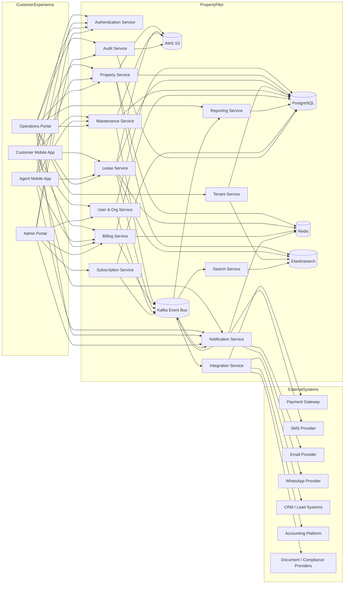
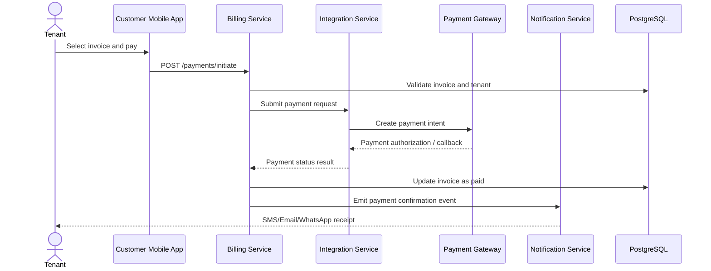
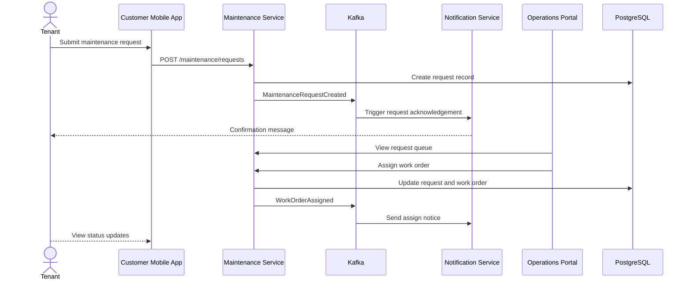
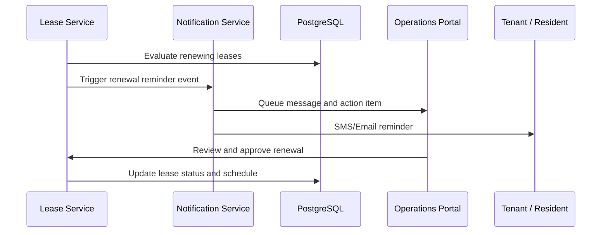
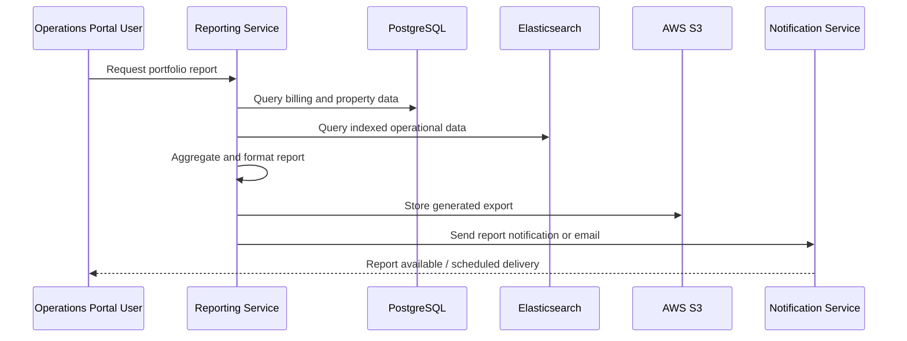
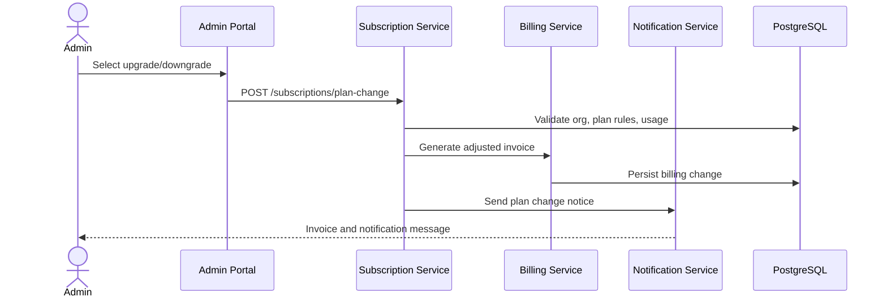

````markdown
# PropertyPilot Application Interaction Map

Document Type: Enterprise Architecture Artifact  
Version: 1.0  
Date: 2026-08-31  
Prepared by: Chief Enterprise Architect  
Audience: Enterprise Architecture, Product, Engineering, Operations, Security, Integration

---

## 1. Purpose

This Application Interaction Map defines how business and system components interact across the PropertyPilot platform. It reflects the integrated operating model for:
- Customer Mobile App
- Agent Mobile App
- Operations Portal
- Admin Portal
- Notification Services
- Payment Processing
- Reporting and Analytics
- Subscription and Billing Management

The map is aligned to enterprise architecture principles:
- modularity and bounded contexts
- service-oriented interaction
- secure and auditable transactions
- asynchronous processing where appropriate
- separation of operational and analytical workloads
- explicit integration contracts with external systems

---

## 2. Scope and Context

The Application Interaction Map covers interactions between:
- end-user applications
- business services
- integration services
- data and analytics services
- external providers and enterprise systems

The map supports the following key domains:
- Property and portfolio management
- Leasing and tenant lifecycle
- Maintenance operations
- Billing and revenue
- Notifications and communication
- Reporting and analytics
- Subscription and account management

---

## 3. System Context Diagram



---

## 4. Application Interaction Matrix

The interaction matrix below describes the core application-to-application communication patterns. Each interaction includes:
- Source Module
- Target Module
- Trigger Event
- Data Exchanged
- Business Rules

### 4.1 Customer Mobile App Interactions

| ID | Source Module | Target Module | Trigger Event | Data Exchanged | Business Rules |
|---|---|---|---|---|---|
| C-01 | Customer Mobile App | Authentication Service | User login | username, password, device info, MFA response | User must be active and assigned to an organization; failed login attempts are logged |
| C-02 | Customer Mobile App | User & Org Service | User profile view | user_id, tenant_id, organization_id, profile details | Tenant can only view own profile and authorized linked records |
| C-03 | Customer Mobile App | Property Service | View property summary | property_id, tenant_id, lease_id, property status | Data is filtered by current tenant relationship and organization boundaries |
| C-04 | Customer Mobile App | Maintenance Service | Submit maintenance request | request_type, description, urgency, photos, property_id, unit_id | Request must include issue details and property linkage; priority is defaulted by issue type |
| C-05 | Customer Mobile App | Maintenance Service | Track request status | request_id, status history, comments, ETA | Only the submitting tenant and authorized staff may view ticket details |
| C-06 | Customer Mobile App | Billing Service | View invoice/payment history | tenant_id, invoice list, payment records, balance | User may only view financial records associated with their lease or account |
| C-07 | Customer Mobile App | Billing Service | Initiate payment | payment_method, amount, invoice_id, tenant_id, source | Payment amount must match invoice or approved balance; payment must be validated before processing |
| C-08 | Customer Mobile App | Notification Service | Receive communications | notification_id, type, subject, message, channel | Notification preference rules apply by user and channel; tenant may opt out of non-critical alerts |
| C-09 | Customer Mobile App | Lease Service | View lease and renewal info | lease_id, start_date, end_date, renewal_date, rent_amount | Lease access allowed only to authorized tenant or organization-admin roles |
| C-10 | Customer Mobile App | Document Service / Storage | Retrieve lease or tenant docs | document_id, file metadata, URL | Documents are permissioned by role and legal ownership; download logs are recorded |

### 4.2 Agent Mobile App Interactions

| ID | Source Module | Target Module | Trigger Event | Data Exchanged | Business Rules |
|---|---|---|---|---|---|
| A-01 | Agent Mobile App | Authentication Service | Agent login | username, password, role, tenant context | Agent must be assigned to the property/portfolio and active in the system |
| A-02 | Agent Mobile App | Leasing Service | Capture lead or applicant record | lead_id, applicant_id, property_interest, source | Lead must not duplicate an active applicant record without merge rules |
| A-03 | Agent Mobile App | Lease Service | Schedule or update tour | tour_id, property_id, unit_id, date_time, notes | Tour must be assigned to an available unit or valid property context |
| A-04 | Agent Mobile App | Lease Service | Create or amend lease | applicant_id, unit_id, dates, rent, fee details | Lease cannot overlap current active lease for same unit without override approval |
| A-05 | Agent Mobile App | Maintenance Service | Create work order | unit_id, issue type, assigned technician, priority | Work order must be linked to valid property and valid issue category |
| A-06 | Agent Mobile App | Maintenance Service | Update work order status | work_order_id, status, technician_id, notes | Status transitions must follow approved workflow states |
| A-07 | Agent Mobile App | Tenant Service | Update tenant contact or profile | tenant_id, contact info, notes | Changes must be auditable; sensitive changes require authorization |
| A-08 | Agent Mobile App | Billing Service | Review delinquency status | tenant_id, invoice_id, overdue_amount, collection_status | Delinquency data limited to assigned portfolio or property rights |
| A-09 | Agent Mobile App | Notification Service | Send reminder to tenant | tenant_id, template_id, reminder_type, due_date | Notification sends only to opted-in or business-required channels |
| A-10 | Agent Mobile App | Audit Service | Create field action log | user_id, action_type, entity, timestamp, notes | All mobile field actions must be recorded for accountability |

### 4.3 Operations Portal Interactions

| ID | Source Module | Target Module | Trigger Event | Data Exchanged | Business Rules |
|---|---|---|---|---|---|
| O-01 | Operations Portal | Property Service | Create property record | property details, address, owner, type, status | Organization must be valid and user authorized to add properties |
| O-02 | Operations Portal | Property Service | Add or update unit | property_id, unit_number, type, rent, occupancy_state | Unit number must be unique within the property |
| O-03 | Operations Portal | Tenant Service | Register tenant | tenant_name, contact_info, unit assignment, lease link | Tenant record cannot duplicate a currently active resident without merge check |
| O-04 | Operations Portal | Lease Service | Approve lease | lease_id, signatory, effective date | Approval requires valid property/unit and required fields complete |
| O-05 | Operations Portal | Maintenance Service | Assign work order | work_order_id, assignee, priority, schedule | Assignee must have role permission and maintenance capability |
| O-06 | Operations Portal | Maintenance Service | Close work order | work_order_id, completion_date, cost, notes | Close action requires final status validation and cost record if applicable |
| O-07 | Operations Portal | Billing Service | Generate invoices | lease_id, billing period, amount, due_date | Invoice generation only for active or approved billing entities |
| O-08 | Operations Portal | Billing Service | Review payment reconciliation | payment transactions, invoice statuses, aging | Reconciliation must preserve full audit trail and accept only valid payment references |
| O-09 | Operations Portal | Reporting Service | Request dashboard or report | org_id, portfolio_id, property_id, date_range, report_type | Report output must respect current user role and organization visibility |
| O-10 | Operations Portal | Notification Service | Trigger reminder | event_type, recipient_user, template, property context | Triggering events must match predefined business rules and channel conditions |
| O-11 | Operations Portal | Audit Service | Review audit trail | entity_type, user_id, change_history, timestamps | Only authorized users may view audit trails beyond their own scope |

### 4.4 Admin Portal Interactions

| ID | Source Module | Target Module | Trigger Event | Data Exchanged | Business Rules |
|---|---|---|---|---|---|
| AD-01 | Admin Portal | User & Org Service | Invite user | email, role, org_id, team assignment | Invitation restricted to org admins; email must be unique in system |
| AD-02 | Admin Portal | User & Org Service | Assign role or access | user_id, role_id, org_scope, permission set | Role assignment must honor least privilege and policy matrix |
| AD-03 | Admin Portal | Subscription Service | Activate plan or upgrade | org_id, plan_id, billing_cycle, effective_date | Plan upgrade requires valid billing account and policy validation |
| AD-04 | Admin Portal | Billing Service | Manage invoice and payment settings | org_id, payment_terms, taxes, notification settings | Settings must be consistent with contract, country, and billing rules |
| AD-05 | Admin Portal | Notification Service | Configure templates | channel, business event, message body, translation settings | Templates must be validated for placeholders and compliance |
| AD-06 | Admin Portal | Audit Service | View security and access logs | logs, action history, user/session metadata | Access limited to privileged admin roles |
| AD-07 | Admin Portal | Search Service | Search records across org | search term, filters, entity type | Search results constrained by role and organization scope |
| AD-08 | Admin Portal | Integration Service | Configure external integration | provider_name, auth configuration, mapping rules | Only approved integrations and verified credentials may be activated |

### 4.5 Notification Interactions

| ID | Source Module | Target Module | Trigger Event | Data Exchanged | Business Rules |
|---|---|---|---|---|---|
| N-01 | Lease Service | Notification Service | Lease renewal due | tenant_id, lease_id, reminder_date, template_id | Notification sent only if tenant has opted in or business event requires delivery |
| N-02 | Billing Service | Notification Service | Upcoming invoice due | invoice_id, tenant_id, due_date, amount | Notification channel chosen by user preference or default rules |
| N-03 | Maintenance Service | Notification Service | Request status change | request_id, tenant_id, status, escalation_context | Completion and escalation notices must follow SLA and priority |
| N-04 | Notification Service | SMS Provider | Deliver SMS | recipient phone, message_body, template_id | Provider call must use validated message content and retry logic |
| N-05 | Notification Service | Email Provider | Deliver email | recipient email, subject, body, template_id | Emails must comply with allowed content and unsubscribe rules |
| N-06 | Notification Service | WhatsApp Provider | Deliver WhatsApp message | recipient phone, payload, template | WhatsApp messages require business approved template and consent |
| N-07 | Notification Service | Audit Service | Record delivery status | notification_id, provider, status, attempts, timestamps | Failed sends are retried according to policy and logged |

### 4.6 Payment Interactions

| ID | Source Module | Target Module | Trigger Event | Data Exchanged | Business Rules |
|---|---|---|---|---|---|
| P-01 | Customer Mobile App | Billing Service | Pay invoice | invoice_id, amount, method, customer_id | Invoice must be valid and not already settled; payment must be authorized |
| P-02 | Billing Service | Integration Service | Submit payment to gateway | invoice_id, amount, payer_id, currency, metadata | Payment request must include valid merchant and reference data |
| P-03 | Integration Service | Payment Gateway | Process payment | payment request payload | System requires secure tokenization and PCI-safe handling |
| P-04 | Payment Gateway | Integration Service | Payment callback / response | payment_status, reference, gateway_id, authorization code | Callback must be idempotent and reconciled against original invoice |
| P-05 | Integration Service | Billing Service | Payment confirmation | payment_record, invoice_id, status | System updates invoice status only after successful validation and reconciliation |
| P-06 | Billing Service | Reporting Service | Update collections dashboard | payment totals, aging, delinquency | Reporting data reflects only committed and reconciled transactions |
| P-07 | Operations Portal | Billing Service | Manual collections action | operator_id, payment_adjustment, notes, invoice_id | Manual edits must be authorized and recorded in audit logs |

### 4.7 Report Generation Interactions

| ID | Source Module | Target Module | Trigger Event | Data Exchanged | Business Rules |
|---|---|---|---|---|---|
| R-01 | Operations Portal | Reporting Service | Generate occupancy report | org_id, property_id, date_range | Access restricted to authorized reporting roles |
| R-02 | Operations Portal | Reporting Service | Generate invoice aging report | org_id, portfolio_id, from_date, to_date | Report must reflect only valid billing records in the current organization |
| R-03 | Reporting Service | PostgreSQL | Retrieve transactional data | query filters and aggregations | Data access respects tenant isolation and row-level security controls |
| R-04 | Reporting Service | Elasticsearch | Query indexed operational data | search terms, filters, aggregations | Search queries must use the allowed index scope and filter criteria |
| R-05 | Reporting Service | Notification Service | Deliver scheduled report | report_id, recipient_email, schedule | Only approved recipients may receive scheduled export |
| R-06 | Admin Portal | Reporting Service | View portfolio KPI dashboard | org_id, dashboard_scope, date_range | Dashboards show only authorized org/portfolio metrics |
| R-07 | Reporting Service | Storage | Export report file | report_id, format, file metadata | File generation and storage must respect retention and export policy |

### 4.8 Subscription Interactions

| ID | Source Module | Target Module | Trigger Event | Data Exchanged | Business Rules |
|---|---|---|---|---|---|
| S-01 | Admin Portal | Subscription Service | View current plan | org_id, current_subscription_id | User must be admin-level and org-scoped |
| S-02 | Admin Portal | Subscription Service | Upgrade plan | current_plan, new_plan, billing_cycle, effective_date | Upgrade allowed only when billing profile is valid and contract rules permit change |
| S-03 | Admin Portal | Subscription Service | Downgrade plan | current_plan, target_plan | Downgrade must respect minimum supported feature set and contract terms |
| S-04 | Subscription Service | Billing Service | Generate subscription invoice | org_id, plan_price, billing_period | Billing created only after validation of subscription terms |
| S-05 | Subscription Service | Audit Service | Log plan changes | subscription_id, old_plan, new_plan, user_id, timestamp | Plan changes must be auditable for legal and financial compliance |
| S-06 | Subscription Service | Notification Service | Send renewal or plan change notification | org_id, plan_name, due_date, recipient | Notification channel determined by org settings and business event policy |
| S-07 | Subscription Service | Integration Service | Sync plan usage with billing provider | usage metrics, org_id, billing period | Usage must be validated before flagging for charge or contract adjustment |

---

## 5. Interaction Model by Functional Domain

### 5.1 Customer Journey Interaction Pattern
Customer journeys primarily use synchronous UI-to-service patterns and a limited set of asynchronous notifications:
- View / query
- Submit
- Pay
- Receive updates
- Download documents

Example:
Customer Mobile App -> Maintenance Service -> Kafka -> Notification Service -> SMS/Email/WhatsApp

### 5.2 Agent Workflow Interaction Pattern
Agent interactions are operational and involve:
- validation and assignment
- field workflow updates
- follow-up tasks
- property and tenant synchronization

Example:
Agent Mobile App -> Lease Service -> PostgreSQL -> Notification Service -> Tenant

### 5.3 Operations Portal Interaction Pattern
Operations portal interactions are management-centric and include:
- create and assign records
- monitor automated tasks
- review analytics and workflows
- invoke reports and export functions

### 5.4 Admin Portal Interaction Pattern
Admin interactions require a controlled security model and include:
- user lifecycle changes
- subscription and billing administration
- integration configuration
- audit and compliance review

---

## 6. End-to-End Sequence Flows

### 6.1 Sequence Flow: Tenant Pays Rent



### 6.2 Sequence Flow: Maintenance Request Lifecycle



### 6.3 Sequence Flow: Lease Renewal Reminder



### 6.4 Sequence Flow: Report Generation



### 6.5 Sequence Flow: Subscription Plan Change



---

## 7. Integration Points

### 7.1 Internal Integration Points
These are integration points within the PropertyPilot platform:
- Customer Mobile App to Authentication Service
- Customer Mobile App to Billing Service
- Agent Mobile App to Lease / Maintenance services
- Operations Portal to Reporting Service
- Admin Portal to Subscription and User services
- All services to PostgreSQL data access layer
- All services to Redis for cache interactions
- Search and reporting services to Elasticsearch
- Object documents to AWS S3
- Asynchronous event propagation through Kafka

### 7.2 External Integration Points
These are integration points with external systems:
- Payment Gateway
- Accounting Platform
- CRM / Lead Source Systems
- SMS Provider
- Email Provider
- WhatsApp Provider
- Document / Compliance Providers
- Potential Identity Provider for enterprise SSO

### 7.3 Integration Patterns
Enterprise-standard patterns used:
- Synchronous REST APIs for request/response workflows
- Event-driven integration via Kafka for decoupled operations
- Message broker retry and dead-letter handling
- API contract versioning
- Idempotent processing for financial operations
- Callback-based reconciliation from payment gateways
- Bulk import/export for accounting and CRM synchronization

---

## 8. External Systems

| External System | Type | Purpose | Integration Pattern | Data Exchanged |
|---|---|---|---|---|
| Payment Gateway | Financial | Process rent and subscription payments | REST API + webhook callback | payment request, payment confirmation, reconciliation |
| SMS Provider | Notification | Deliver SMS reminders and alerts | API integration | phone, message text, template metadata |
| Email Provider | Notification | Deliver email notifications and reports | API integration | recipient, subject, body, attachments |
| WhatsApp Provider | Notification | Resident and team messaging | Business API / template-based | phone, template, message payload |
| CRM / Lead Systems | Lead & Prospect | Capture and qualify applicants | API + batch sync | lead records, source, status |
| Accounting Platform | Financial Ops | Sync accounting entries and invoices | API / scheduled import | invoicing, GL mapping, payment data |
| Document / Compliance Provider | Compliance | Track compliance docs or document lifecycle | API + file exchange | doc metadata, expiry, versioning |
| Identity Provider (optional) | Security | SSO and enterprise authentication | OIDC/OAuth2 | users, tenant idp mapping, assertions |

---

## 9. Application Interaction Constraints and Rules

### 9.1 Security Rules
- All interactions requiring account access must be authenticated and authorized
- Role-based interactions must enforce property and org scope
- Payment, subscription, and audit actions require traceable approval or active role
- Sensitive records must not be exposed to users outside authorized boundaries
- Audit logs must be created for all financial, compliance, and security-relevant changes

### 9.2 Data Ownership Rules
- Property data is owned by the Property Service
- Billing data is owned by the Billing Service
- Lease data is owned by the Lease Service
- Tenant data is owned by the Tenant Service
- Notification data is owned by the Notification Service
- Document storage is externalized to AWS S3 with metadata managed in PostgreSQL

### 9.3 Transactional Rules
- Payment operations must be idempotent
- Lease creation must respect unit and time constraints
- Maintenance operations must follow valid lifecycle transitions
- Notification events cannot be used as the source of truth for billing or lease state
- Reporting outputs must use committed data only

### 9.4 Asynchronous Rules
- Non-blocking notifications may be generated from domain events
- Search indexing should occur after successful transaction commit
- Integration syncs are decoupled from UI actions and must be retried on failure

---

## 10. Enterprise Architecture Standards Alignment

This interaction map aligns to enterprise architecture standards in the following ways:

### 10.1 Functional Decomposition
Interactions are aligned to specific business domains and service domains, avoiding cross-functional coupling.

### 10.2 Integration Standards
The architecture uses:
- REST for synchronous interactions
- Kafka for event-driven communications
- API contracts for predictable interfaces
- provider abstraction for external systems

### 10.3 Traceability
All interactions are traceable to:
- business processes
- user stories
- service catalog entries
- security roles
- reporting needs
- subscription and billing policies

### 10.4 Governance
Each interaction is subject to:
- audit logging
- RBAC enforcement
- data retention rules
- operational monitoring
- change control

---

## 11. Summary

The PropertyPilot application interaction map reflects a secure, modular, enterprise-ready architecture that supports:
- mobile-first customer and field experiences
- transactional property and lease operations
- operational coordination for managers and staff
- secure admin governance
- external payment and communication integrations
- scalable reporting and subscription management

This interaction map provides the common structure required for:
- engineering implementation
- service design
- integration planning
- QA scenario coverage
- operational monitoring and support

---

## 12. Recommended Next Artifacts
The following artifacts should be produced as supporting architecture deliverables:
- API Contract Catalog
- Event Catalog and Topic Matrix
- Business Service Interaction Diagrams
- Sequence Diagrams by Journey
- Security Role-to-Interaction Matrix
- Integration Contract Definitions
- Operational Runbooks and SLAs

This Application Interaction Map is intended as the authoritative interaction baseline for application design, integration design, and implementation governance.
````
````

---

## 13. Appended Missing Interactions

### 13.1 Public Website and Customer Property-Service Interactions

| ID | Source Module | Target Module | Trigger Event | Data Exchanged | Business Rules |
|---|---|---|---|---|---|
| PC-01 | Public Website | Pricing Service | Guest requests service estimate | property type, location, size, selected service, frequency | Guest estimates do not create a customer account; protected data is not returned |
| PC-02 | Public Website | Subscription Service | Guest compares plans | property context, selected plans, included services, savings | Only active plans and current entitlements are compared |
| PC-03 | Customer Mobile App | Property Service | Register or update property | property type, location, survey number, property details, status | Customer may manage only own or authorised shared properties |
| PC-04 | Customer Mobile App | Document and Media Evidence Service | Upload property documents or photos | property_id, document type, media metadata, object reference | Upload requires property ownership/permission and evidence integrity validation |
| PC-05 | Customer Mobile App | Property and Ownership Service | Invite or approve co-owner | property_id, invitee, ownership role, access permissions, approval state | Invitation, approval, and role changes are auditable and require authorised owner scope |
| PC-06 | Customer Mobile App | Service Catalog and Request Service | Browse eligible services and submit booking | property_id, service_id, eligibility result, schedule preference, request details | Service must be active and eligible for property, coverage, and subscription status |
| PC-07 | Customer Mobile App | Verification Service | Book GPS or ownership verification | property_id, verification type, supporting documents, payment reference | Verification request follows payment and document requirements before assignment |
| PC-08 | Customer Mobile App | Media Evidence and Report Service | View verification or monitoring result | request_id, report metadata, evidence references, secure-download request | Access is restricted to the customer, authorised co-owner, or authorised operations role |

### 13.2 Field, Monitoring, and Alert Interactions

| ID | Source Module | Target Module | Trigger Event | Data Exchanged | Business Rules |
|---|---|---|---|---|---|
| FM-01 | Subscription Service | Scheduling and Monitoring Service | Subscription activates after confirmed payment | subscription_id, property_id, entitlement, monitoring frequency, effective dates | Scheduled visits are created only for active, paid entitlements |
| FM-02 | Scheduling and Monitoring Service | Agent and Visit Service | Create recurring or one-time visit assignment | request_id, property_id, visit window, required skills, assignment scope | Assignment must match coverage, availability, skill, and property access rules |
| FM-03 | Agent Mobile App | Agent and Visit Service | Accept task, start visit, or complete visit | task_id, visit_id, agent_id, visit status, timestamps | Valid state transitions and assigned-agent scope are enforced |
| FM-04 | Agent Mobile App | Geo-location and Media Evidence Service | Capture GPS, photos, video, observations, or signature | visit_id, location, accuracy, capture time, media metadata, observation | Offline capture is encrypted and synchronised idempotently; evidence is validated for property and visit scope |
| FM-05 | Media Evidence Service | AWS S3 | Store evidence object | signed upload request, object key, checksum, content type, encryption metadata | Buckets are private; media is scanned, versioned, access-logged, and retention-tagged |
| FM-06 | Agent and Visit Service | Media Evidence and Report Service | Submit monitoring or verification report | visit_id, evidence references, findings, recommendations, report type | Report generation requires completed evidence validation |
| FM-07 | Monitoring Service | Notification Service | Issue detected during monitoring | property_id, alert type, severity, evidence references, recommended service | Notification respects channel rules; critical alerts are not suppressed by marketing opt-out |
| FM-08 | Customer Mobile App | Service Catalog and Request Service | Customer approves recommended remediation | alert_id, selected service, approval, payment reference | Approval creates a traceable follow-on request linked to the original alert |

### 13.3 Vendor, Complaint, and NRI Interactions

| ID | Source Module | Target Module | Trigger Event | Data Exchanged | Business Rules |
|---|---|---|---|---|---|
| VC-01 | Operations Portal | Vendor and Quotation Service | Request vendor quotations | service request, scope, property context, required date | Only approved vendors supporting the service and coverage area may receive the request |
| VC-02 | Vendor Portal | Vendor and Quotation Service | Submit or revise quotation | quotation, pricing, availability, scope assumptions, validity | Quotation versions are auditable and available for authorised comparison |
| VC-03 | Operations Portal | Vendor and Quotation Service | Select quotation and assign job | quotation_id, vendor_id, job scope, schedule, approval | Selection requires authorised approval and creates an immutable assignment record |
| VC-04 | Vendor Portal | Media Evidence and Report Service | Submit job-completion evidence and invoice | job_id, evidence, completion record, invoice | Completion must be reviewed before settlement; vendor sees only assigned work |
| VC-05 | Customer Mobile App | Complaint and Case Service | Raise complaint or request support | customer_id, related request/payment/report, category, description, attachments | Case ownership, SLA, and escalation path are assigned and auditable |
| VC-06 | Complaint and Case Service | Notification Service | Escalate or resolve case | complaint_id, owner, SLA status, resolution, customer notice | Escalations follow severity and SLA rules; closure requires a recorded resolution |
| VC-07 | NRI Experience | Monitoring, Report, and Notification Services | View remote-property status or receive emergency alert | property summary, monitoring report, video evidence, alert severity | NRI access is limited to owned/shared properties and approved communication channels |
| VC-08 | NRI Experience | Relationship Manager Service | Send or receive managed support communication | customer_id, property_id, message, conversation context | Communication is retained, permissioned, and auditable |

### 13.4 Marketplace, Administration, and Event Interactions

| ID | Source Module | Target Module | Trigger Event | Data Exchanged | Business Rules |
|---|---|---|---|---|---|
| MA-01 | Customer Mobile App or Public Website | Marketplace and Lead Protection Service | Search, shortlist, list, or enquire about property | search criteria, listing data, customer/lead reference, enquiry | Public discovery returns only permitted listing data; protected identities remain masked |
| MA-02 | Marketplace and Lead Protection Service | Operations Portal | Route buyer-seller or customer-vendor enquiry | lead_id, protected contact context, property/service context, workflow state | PropertyPilot mediates communication and controls contact disclosure |
| MA-03 | Operations Portal | Marketplace and Lead Protection Service | Approve contact disclosure, matching, or commission action | disclosure decision, match result, commission record, approver | Disclosure and commission actions require authorisation and full audit trail |
| MA-04 | Admin Portal | Service Catalog and Request Service | Create or configure service | service category, eligibility, required skills, SLA, pricing inputs, status | Only authorised administrators may activate, suspend, retire, or change service configuration |
| MA-05 | Admin Portal | Pricing Service | Configure pricing or run simulation | pricing rules, travel/food allowances, platform fee, margin, scenario inputs | Changes require audit logging and approved effective dates |
| MA-06 | Admin Portal | Subscription Service | Configure plan entitlements | plan, visit frequency, included services, SLA, pause/refund/carry-forward rules | Plan changes are versioned and must not alter existing contractual entitlements unexpectedly |
| MA-07 | Domain Services | Transactional Outbox and Kafka | Publish committed domain event | event type, aggregate ID, event version, correlation ID, payload reference | Events are emitted after commit, idempotent, schema-versioned, and sent to a dead-letter flow on failure |
| MA-08 | Kafka Consumers | Search, Reporting, Notification, Integration, and Audit Services | Consume domain event | event payload, consumer result, retry metadata | Consumers are independently scalable and record processing status, retries, and failures |
