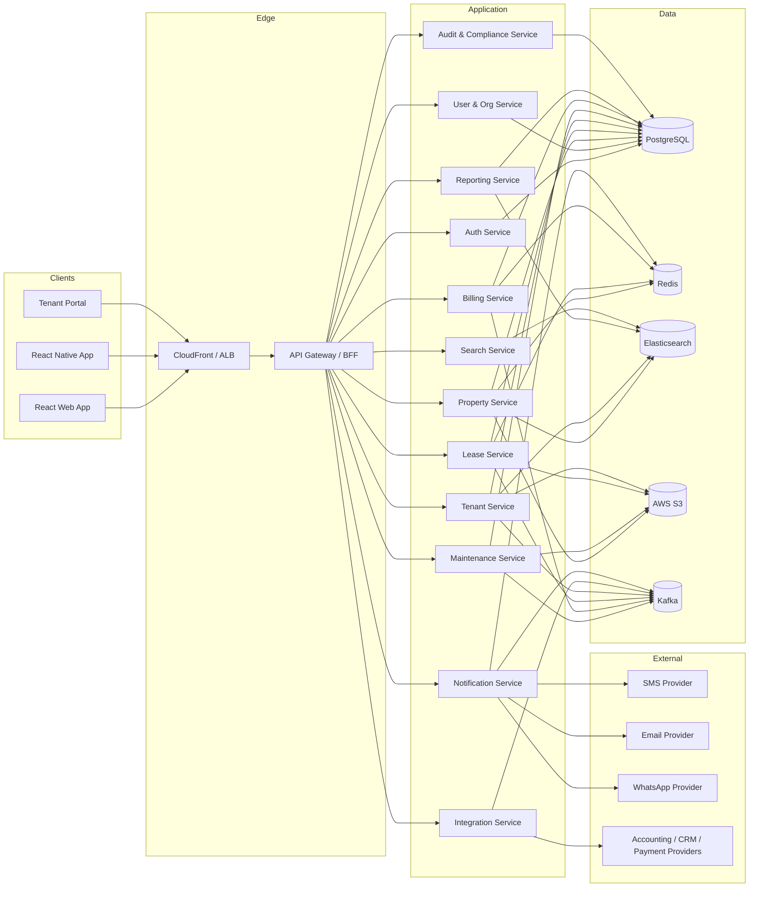
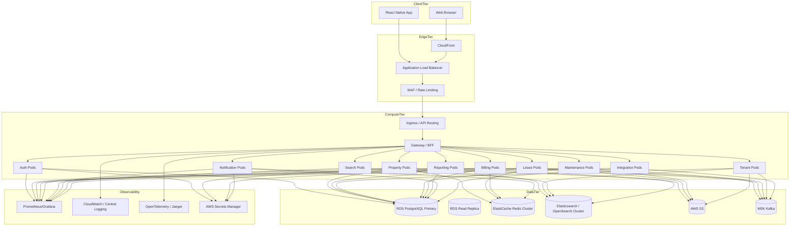
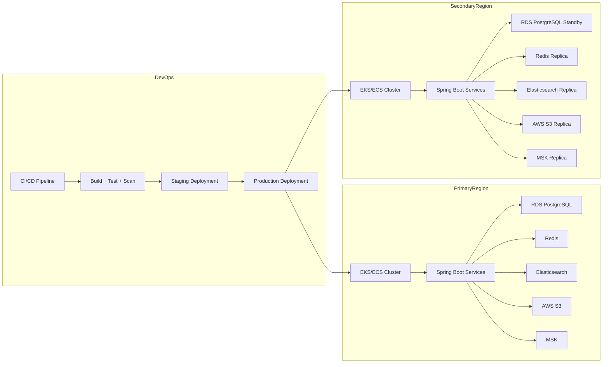
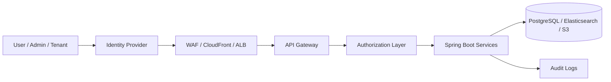
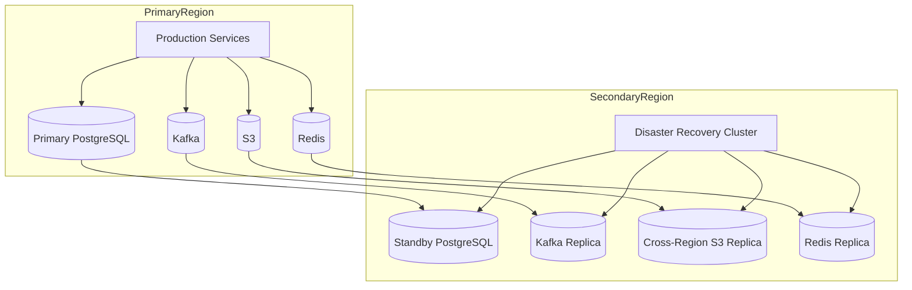
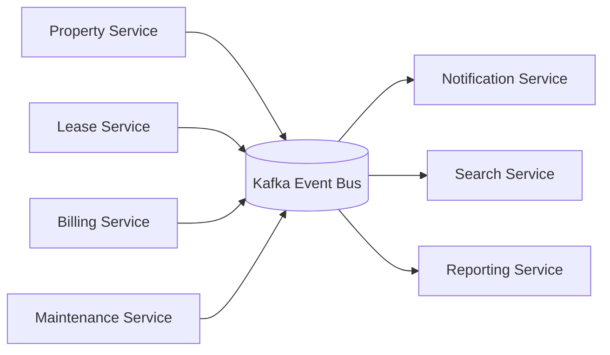
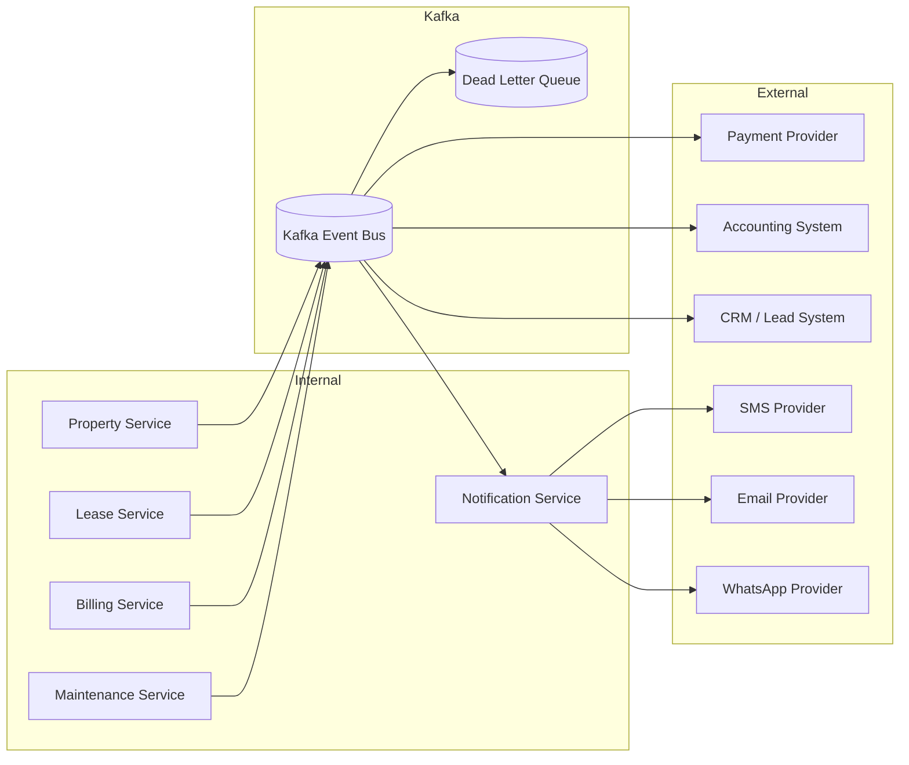

# PropertyPilot Technical Architecture

## 1. Overview

PropertyPilot is a multi-tenant real estate and property operations platform designed to support property owners, managers, tenants, leasing teams, admins, and technicians across the full lifecycle of property operations. The platform combines property management, financial tracking, lease administration, maintenance workflows, document storage, tenant communication, reporting, and integrations into a unified system.

This architecture is based on:
- Frontend: React
- Mobile: React Native
- Backend: Spring Boot
- Database: PostgreSQL
- Cache: Redis
- Search: Elasticsearch
- Storage: AWS S3
- Messaging: Kafka
- Notifications: SMS, Email, WhatsApp
- Cloud Infra: AWS managed services with container orchestration and observability

---

## 2. Architecture Goals

- Support multi-tenant property and portfolio management
- Keep transactional data consistent and secure
- Support role-based access for owners, managers, tenants, and support staff
- Provide real-time operational dashboards and scheduled reporting
- Scale horizontally for multiple properties and organizations
- Decouple async workflows using events and messaging
- Support external integrations without tightly coupling systems
- Ensure compliance, auditing, reliability, and recovery

---

## 3. Technology Stack

### Application
- React for web frontend
- React Native for mobile app
- Spring Boot for backend services

### Data and Processing
- PostgreSQL for transactional database
- Redis for caching and session store
- Elasticsearch for search and analytics indexing
- Kafka for event streaming and async integration
- AWS S3 for files, media, and documents

### Communication and Notifications
- SMS provider
- Email provider
- WhatsApp provider

### Infrastructure
- AWS EKS or ECS for container orchestration
- AWS ALB / API Gateway / CloudFront
- RDS PostgreSQL
- ElastiCache Redis
- OpenSearch / Elasticsearch
- Amazon S3
- Amazon MSK for Kafka
- AWS Secrets Manager
- CloudWatch / Prometheus / Grafana / OpenTelemetry

---

## 4. Logical Architecture

The logical architecture separates user experience, domain services, data storage, and integrations.



### 4.1 Presentation Layer
- React web application for business users
- React Native app for mobile and field staff
- Tenant portal for self-service and resident experiences

### 4.2 Application Layer
- Auth Service: authentication, authorization, session handling, MFA
- User & Organization Service: users, roles, permissions, organization structure
- Property Service: property records, portfolios, units, and site data
- Lease Service: lease generation, renewals, expirations
- Tenant Service: tenant data and histories
- Maintenance Service: service requests and work orders
- Billing Service: rent, invoices, delinquencies, expenses
- Reporting Service: dashboards, analytics, exports
- Notification Service: SMS, email, WhatsApp dispatch
- Search Service: search index and retrieval
- Integration Service: external integrations and sync orchestration
- Audit & Compliance Service: logs, approvals, audit trails

### 4.3 Data Layer
- PostgreSQL is the transactional source of truth
- Redis provides fast reads and transient cache
- Elasticsearch supports full-text search and reporting indexes
- AWS S3 stores documents, lease files, property images, and attachments
- Kafka handles event streaming and inter-service communication

---

## 5. Physical Architecture

The physical architecture shows the actual AWS deployment model used to host the platform.



### Physical Considerations
- Compute is containerized and horizontally scalable
- RDS PostgreSQL is the operational DB
- Redis is deployed as a cluster for low-latency reads
- Elasticsearch is deployed as a cluster for search and operational indexing
- Kafka is deployed as a managed cluster for asynchronous event processing
- Data is segmented by organization, property, and tenant boundaries
- Dedicated storage buckets for documents and media are isolated by business need

---

## 6. Deployment Architecture

PropertyPilot uses a cloud-native deployment model with region-aware failover and CI/CD automation.



### Deployment Model
- Containerized microservices deployed via Kubernetes or ECS
- Separate environments for dev, staging, and production
- Blue/green or rolling deployment for zero-downtime updates
- Automated tests, static analysis, dependency scanning, and container image validation
- Health checks and smoke tests before promotion
- Secrets managed centrally through AWS Secrets Manager
- Monitoring and rollback integrated into the deployment pipeline

---

## 7. Security Architecture

Security is implemented at several layers: identity, application, service-to-service, data, and infrastructure.

### 7.1 Identity and Access Management
- OAuth2 / OIDC for user authentication
- JWT-based role-aware authorization
- RBAC / ABAC supporting:
  - Admin
  - Owner
  - Property Manager
  - Staff
  - Tenant
  - Technician
- MFA for privileged users
- SSO support for enterprise clients

### 7.2 Edge Security
- CloudFront and WAF for public traffic protection
- TLS termination at edge and ingress
- Rate limiting and bot protection
- Zero-trust alignment for service access

### 7.3 Service Security
- Spring Security for resources and endpoints
- Service-to-service auth using mTLS or signed tokens
- Secrets managed in Secrets Manager
- Least-privilege IAM roles
- No direct public exposure for internal-only services

### 7.4 Data Security
- Encryption in transit with TLS 1.2+
- Encryption at rest for PostgreSQL, S3, Redis, Kafka, Elasticsearch
- PII protection and field encryption for sensitive personal and financial data
- Audit logging for user actions, document access, and sensitive updates

### 7.5 Compliance and Governance
- Tenant and property data isolation by role and organization
- Audit trails for critical financial and operational events
- Document retention and policy controls
- Access review workflows for admin and security teams



---

## 8. Scalability Strategy

PropertyPilot will scale both vertically and horizontally based on workload type.

### 8.1 Horizontal Scaling
- Stateless application services can scale independently
- Kubernetes HPA or ECS autoscaling based on CPU, memory, and request rate
- Load balancing across multiple containers and availability zones

### 8.2 Database Scaling
- PostgreSQL primary with read replicas
- Read-heavy workloads distributed to replicas
- Partitioning for large tables such as:
  - invoices
  - tenant metadata
  - maintenance history
  - audit logs
- Connection pooling and query optimization

### 8.3 Cache Strategy
- Redis for:
  - hot property data
  - session management
  - tenant data caching
  - feature flags
  - notification deduplication
  - dashboard data
- Cache-aside and write-through patterns where appropriate

### 8.4 Search Strategy
- Elasticsearch indexes:
  - properties
  - leases
  - tenants
  - work orders
  - documents
  - support tickets
- Search clusters partitioned by environment and use case
- Index templates and alias-based updates to minimize downtime

### 8.5 Event-Driven Scaling
- Kafka decouples asynchronous processing
- Notification, search indexing, billing, and reporting jobs are event-driven
- Consumers scale independently to absorb bursts without impacting request latency

### 8.6 Performance Strategy
- API caching where safe
- Asynchronous reporting jobs
- Bulk operations for export and indexing
- Query optimization and indexing strategy for large operational datasets

---

## 9. Disaster Recovery Strategy

PropertyPilot must maintain reliability, recoverability, and continuity across infrastructure or region events.

### 9.1 Recovery Objectives
- RPO: target 15 minutes or less for critical transactional data
- RTO: target under 1 hour for core service restoration in a regional event

### 9.2 Backup and Recovery
- PostgreSQL automated backups with point-in-time recovery
- Multi-AZ deployment for primary DB
- RDS cross-region snapshot strategy
- S3 versioning and cross-region replication
- Elasticsearch snapshot backups
- Redis replication and failover support
- Kafka replication with partition copies

### 9.3 Failover
- Active/standby architecture across availability zones and regions
- Automatic failover for DB and cache
- Traffic rerouting via load balancer and DNS failover
- Application health checks and readiness probes

### 9.4 Operational Recovery
- Runbooks for:
  - infrastructure failure
  - database failover
  - service rollback
  - cache restore
  - message replay
- Automated health checks and synthetic monitoring
- Incident management with escalation and command path



---

## 10. Microservices Design

PropertyPilot follows a domain-oriented microservice model to isolate business capabilities and improve team ownership.

### 10.1 Service Inventory

#### Auth Service
- Handles login, token validation, refresh, and user sessions
- Supports SSO and MFA

#### User & Organization Service
- Users, roles, access, organizations, and teams
- Tenant assignment to property groups

#### Property Service
- Property setup, portfolio grouping, unit management
- Property and building metadata

#### Lease Service
- Lease creation, renewals, expirations, clauses, and document linkage

#### Tenant Service
- Tenant profile and communication records
- Occupancy and household tracking

#### Maintenance Service
- Service requests, work orders, assignments, updates, and completion

#### Billing Service
- Invoices, payments, delinquency, expense tracking, and revenue reporting

#### Reporting Service
- Dashboards, KPIs, exports, scheduled reporting, and operational views

#### Notification Service
- SMS, email, and WhatsApp message orchestration
- Notification templates and delivery tracking

#### Search Service
- Search indexing, filtering, and aggregate retrieval

#### Integration Service
- Third-party API connectors for payment, accounting, CRM, and vendor systems

#### Audit & Compliance Service
- Access logs, procedural validation, policy checks, compliance tasks

### 10.2 Event-Driven Communication
Each service emits domain events into Kafka. Examples:
- PropertyCreated
- TenantAdded
- LeaseActivated
- InvoiceGenerated
- PaymentReceived
- MaintenanceRequestCreated
- WorkOrderAssigned
- NotificationSent

These events are consumed by:
- Notification Service
- Search Service
- Reporting Service
- Integration Service
- Audit Service



### 10.3 Service Boundaries
- Property data remains owned by the Property Service
- Lease and billing data are separate but linked through events
- Maintenance records are independent but cross-reference properties and tenants
- Documents are stored in S3 and referenced by metadata in PostgreSQL
- Search and analytics are read-model based

---

## 11. Integration Architecture

PropertyPilot integrates with internal services and external providers while keeping the platform decoupled, auditable, and resilient.

### 11.1 Internal Integration
- REST-based synchronous interactions for real-time operations
- Kafka event-driven communication for async updates
- Shared DTOs and event contracts for common business entities

### 11.2 External Integration
- Payment processors
- Accounting systems
- CRM and lead management systems
- Property listing channels
- Email service providers
- SMS providers
- WhatsApp provider
- Vendor workflows and document systems

### 11.3 Integration Patterns
- Synchronous:
  - REST APIs for immediate operations and lookups
- Asynchronous:
  - Kafka topics for notification, indexing, and downstream sync
- Batch:
  - nightly or scheduled sync for financial and operational imports
- Webhooks:
  - inbound external events affecting payments, invoices, or updates

### 11.4 Integration Reliability
- Retry with backoff
- Idempotent message handling
- Dead-letter queue for failure isolation
- Monitoring and alerting for sync failures
- Audit logs of all data movement



---

## 12. Observability and Operations

### 12.1 Monitoring
- Metrics: API latency, error rate, queue lag, DB load, Redis performance
- Logs: centralized structured logging with correlation IDs
- Tracing: distributed tracing across services and event consumers

### 12.2 Alerting
- Credit and billing failures
- Maintenance SLA breaches
- Search index lag
- Kafka backlog
- Notification delivery failures
- Database failover or replication lag
- Unauthorized access or suspicious activity

---

## 13. Architectural Decisions Summary

- Spring Boot microservices for business domain separation and independent deployments
- PostgreSQL as the system of record for transactional consistency
- Redis for low-latency caching and session support
- Elasticsearch for query-rich search and operational indexing
- Kafka for decoupled asynchronous processing and data movement
- AWS S3 for document and media storage
- React + React Native to support web and mobile experiences
- AWS as the cloud foundation for resilience, security, scalability, and monitoring

---

## 14. Final Architecture Summary

PropertyPilot’s technical architecture is designed to support a large, multi-tenant property operations platform with the following characteristics:
- secure and role-aware access control
- modular microservice boundaries
- transactional reliability with PostgreSQL
- fast operational reads with Redis
- search and reporting using Elasticsearch
- event-driven processing via Kafka
- file and document persistence in AWS S3
- external communication through SMS, email, and WhatsApp
- high availability and failover with AWS-managed services
- operational observability across application, data, and infrastructure layers

This architecture provides a strong foundation for MVP delivery, phased expansion, and future enterprise growth.

---

## 15. Recommended Next Steps

- Define detailed service contracts and API specs
- Create PostgreSQL schema and migration plans
- Define Kafka topic catalog and event schemas
- Build IAM and RBAC matrix
- Define tenant isolation model and storage boundaries
- Design backup, failover, and restoration runbooks
- Set up CI/CD, observability, and alerting baselines
- Prepare dev, staging, and production environment topology
````
````

---

## 16. Product-Service Domain Architecture

The service inventory shall include the following product-service domains in addition to the property-management services already defined. Each domain owns its transactional data and exposes APIs/events; services may reference another domain's identifier but shall not write to its tables directly.

| Domain service | Primary responsibility | Physical-model ownership | Key consumers |
|---|---|---|---|
| Customer Service | customer profiles, addresses, registration status, and consent | `customers`, `customer_addresses` | Customer app, Auth Service, Property Service |
| Property and Ownership Service | customer property records, shared ownership, documents, and property metadata | `properties`, `property_documents` | Customer app, Service Request Service, Marketplace Service |
| Service Catalog and Request Service | service definitions, eligibility, pricing inputs, booking lifecycle, and assignment request creation | `services`, `service_requests` | Customer app, Operations Portal, Pricing Service |
| Agent and Visit Service | agent skills, task acceptance, visits, GPS capture, and visit completion | `agents`, `agent_skills`, `visits`, `gps_captures` | Agent app, Operations Portal, Report Service |
| Media Evidence and Report Service | secure evidence ingestion, integrity metadata, report generation, and delivery | `evidence`, `reports` plus S3 objects | Agent app, Customer app, Operations Portal |
| Subscription Service | plans, entitlements, renewals, scheduling eligibility, and subscription state | `subscription_plans`, `customer_subscriptions`, `subscription_renewals` | Customer app, Scheduling Service, Billing Service |
| Payment and Refund Service | payment-gateway orchestration, invoices, refunds, receipts, and settlement state | `payments`, `invoices`, `refunds` | Checkout, Subscription Service, Vendor Portal |
| Vendor and Quotation Service | vendor onboarding, service capability, quotation, assignment, completion approval, and payouts | `vendors`, `quotations`, `vendor_assignments`, `partners`, `partner_services` | Vendor Portal, Operations Portal, Marketplace Service |
| Complaint and Case Service | complaint intake, comments, ownership, escalation, and closure | `complaints`, `complaint_comments` | Customer app, Operations Portal, Notification Service |
| Pricing Service | guest and authenticated cost estimation, packages, subscriptions, travel inputs, and pricing simulations | pricing rules and calculated-price read models | Public website, Customer app, Admin Portal |
| Marketplace and Lead Protection Service | listings, enquiries, protected communication, lead access rules, matching, and commissions | marketplace/lead records in its owned schema | Public website, Customer app, Admin Portal |

### 16.1 Service Request and Field-Execution Lifecycle

Service requests shall be orchestrated as a stateful workflow:

```text
Estimate or Service Selection -> Booking -> Payment Authorisation -> Assignment
-> Agent/Vendor Acceptance -> Visit or Execution -> Evidence Validation
-> Report or Completion Approval -> Settlement -> Customer Closure
```

The workflow shall support verification, monitoring, construction, cleaning, vendor, and emergency service types. It shall publish idempotent events including `ServiceRequested`, `PaymentConfirmed`, `AssignmentCreated`, `VisitStarted`, `EvidenceSubmitted`, `ReportGenerated`, `ServiceCompleted`, `ComplaintOpened`, and `RefundIssued`.

### 16.2 Subscription and Monitoring Orchestration

Subscription activation shall create entitlement and recurring-visit schedules only after confirmed payment. The orchestration must handle plan comparison, upgrade, renewal, pause, expiry, failed payment, scheduled visits, alert-driven follow-on service requests, and cancellation/refund eligibility. Subscription and monitoring events shall be consumed by Scheduling, Notification, Billing, Reporting, and Customer Dashboard read models.

---

## 17. Channel and Experience Architecture

The presentation layer shall use channel-specific BFF/API surfaces rather than exposing one undifferentiated API to all screens.

| Channel | Architectural capability | Primary backend domains |
|---|---|---|
| Public website | public service catalog, guest cost calculator, plan comparison, marketing, registration, and marketplace discovery | Pricing, Service Catalog, Subscription, Marketplace |
| Customer app and portal | property, shared ownership, service booking/tracking, reports/evidence, subscriptions, payments, and complaints | Customer, Property, Service Request, Report, Subscription, Payment, Complaint |
| Agent mobile app | assigned tasks, visit state, offline capture, GPS, photo/video, observations, evidence submission, and report drafting | Agent/Visit, Media Evidence, Report |
| Vendor portal | jobs, acceptance, execution evidence, invoice submission, settlement, and performance | Vendor/Quotation, Media Evidence, Payment |
| Operations portal | queues, assignment, visit monitoring, report review, customer/property operations, complaints, and escalations | Service Request, Agent/Visit, Report, Complaint |
| Admin portal | users/roles, partners/vendors, service and subscription setup, pricing, coupons, payments, audit, marketplace, and analytics administration | User & Organization, Service Catalog, Pricing, Subscription, Payment, Audit, Marketplace |
| NRI experiences | remote-property summary, video reports, relationship-manager communication, and emergency alerts | Property, Monitoring, Media Evidence, Notification |

### 17.1 Mobile Field-Work Architecture

The Agent App shall use a local encrypted store and an upload queue for offline work. GPS, photo, video, observations, and digital signatures are captured with device/time metadata, then synchronised through resumable uploads. The server validates assignment, property scope, evidence type, location accuracy, timestamp integrity, duplicate submission, and malware before marking evidence available for reports. Conflict handling and idempotency keys are required for reconnect and retry scenarios.

---

## 18. Data Architecture Alignment

### 18.1 Tenant Scope, Ownership, and Integrity

Every tenant-scoped table shall carry an organization scope and enforce it through database row-level security or an equivalently centrally enforced data-access policy. Customer, property, service request, visit, evidence, report, payment, subscription, vendor, and complaint access must additionally validate resource ownership or assigned operational scope. Shared-property ownership requires an explicit ownership/access relation rather than relying only on `properties.customer_id`.

Foreign keys, unique constraints, lifecycle status checks, and optimistic-lock versions shall be defined for all relationships in the physical model. Application services shall use managed migrations, connection pooling, and least-privilege database roles; direct cross-service table access is prohibited.

### 18.2 Object Storage and Evidence Metadata

S3 objects shall be private and accessed through short-lived, scoped upload/download URLs. `property_documents` and `evidence` shall retain immutable metadata including object key, checksum, content type, capture time, uploader, property/request/visit reference, and integrity-validation outcome. Media must be encrypted, virus-scanned, access-logged, retention-tagged, and versioned; generated reports must retain provenance to the evidence from which they were produced.

### 18.3 Read Models, Retention, and Recovery

PostgreSQL remains the source of truth. Search, dashboards, public catalog reads, and analytics shall be derived read models populated through an outbox/CDC pattern so that database commits and Kafka publication cannot diverge. Partitioning and retention must be applied to audit logs, notifications, evidence, and reports as specified in the physical model, with deletion/anonymisation workflows and legal-hold support. Backup and restore tests must prove recovery of both relational records and the corresponding S3 objects.

---

## 19. Security-Design Implementation Alignment

The following controls are required to implement the Security Design within the technical architecture:

| Security area | Architecture requirement |
|---|---|
| Authentication and sessions | Separate customer, agent, vendor, and privileged-admin policies for password/OTP login; enforce OTP expiry/retry limits, account lockout, MFA for privileged roles, device tracking, session revocation, and concurrent-session controls. |
| Authorization | Enforce role, permission, resource ownership, organization scope, and assignment/cluster scope at the gateway and service layer; use short-lived tokens with scoped claims and deny-by-default policies. |
| API and webhook protection | Validate requests and responses, apply per-channel rate limits, use idempotency keys for payment/booking operations, authenticate webhook signatures, and isolate public APIs from administrative and field-operation APIs. |
| Location, evidence, and reports | Encrypt GPS and media, restrict access by assignment and ownership, record downloads, watermark externally shared reports, and detect fake GPS, duplicate evidence, timestamp tampering, wrong-property upload, and unauthorised modification. |
| Payment and payout security | Use tokenised payment-gateway flows without storing card credentials; encrypt payout data, require approval segregation for settlement/refund actions, and audit all financial state changes. |
| Privacy and protected interactions | Support consent, retention/deletion requests, contact masking, mediated buyer-seller and customer-vendor communication, and audit trails for contact disclosure decisions. |
| Detection and response | Send authentication, privilege escalation, mass download, API abuse, payment fraud, and evidence-integrity signals to the security monitoring and incident-management workflow. |

---

## 20. Journey Orchestration and Integration Boundaries

The customer journeys require long-running orchestration across pricing, payment, assignment, field execution, reporting, subscription, and notification domains. These flows shall be implemented as sagas with durable state, compensating actions, correlation IDs, timeouts, and manual-operations queues—not as a single synchronous request chain.

| Journey | Orchestration requirements |
|---|---|
| Guest cost estimate and plan comparison | permit anonymous calculation; persist no customer record until registration/purchase; convert the accepted estimate into a versioned booking or subscription quote. |
| Property registration and verification | validate documents and property ownership, create a scoped property, collect payment when required, dispatch verification, validate field evidence, generate the report, and notify the customer. |
| Service booking and monitoring | verify property/service eligibility, price and collect payment, assign an eligible agent/vendor, schedule execution, deliver evidence/report, and handle alert-driven follow-on work. |
| Vendor execution | manage quotation, approval, job acceptance, evidence, customer/operations completion approval, invoice, and settlement with separation of duties. |
| Marketplace and protected contact | keep buyer/seller and customer/vendor identities masked until an authorised disclosure decision; route communication through PropertyPilot and retain a complete audit trail. |
| Complaints and escalation | open cases from customer channels or operational alerts, notify owners, track comments/SLA, allow remediation/refund, and close only after an auditable resolution. |

External integrations shall use an adapter boundary and an integration ledger recording correlation ID, payload version, provider response, retries, and final status. Provider callbacks for payments, messaging, and marketplace activity must pass signature validation and be idempotently processed.

---

# Additional Architecture Components

| Component | Responsibility | Primary interfaces and data |
|---|---|---|
| CRM and Lead Management Service | Capture, qualify, assign, convert, and audit service, subscription, marketplace, referral, and manual leads. | Lead lifecycle APIs; customer, property, service-request, subscription, and marketplace references. |
| Knowledge Base Service | Publish searchable support/FAQ articles for customer support flows. | Read-only customer article retrieval; role-scoped authoring/admin management. |
| Promotion and Coupon Component | Manage coupon lifecycle and validate eligible discounts for services and subscriptions. | Coupon administration APIs; versioned pricing-rule and payment references. |
| Report Quality Review Component | Enforce report approval, rejection, rework, reviewer notes, and audit history before a report is customer-deliverable. | Report review API; report, evidence, visit, service-request, and operations-user references. |
| Subscription Scheduling and Entitlement Worker | Materialise active plan entitlements into recurring visits; enforce visit consumption, pause, expiry, renewal, and idempotent schedule generation. | Subscription events; service requests, visits, reports, payments, and renewal records. |

# Additional Integrations

| Integration | Purpose | Interaction pattern |
|---|---|---|
| KYC and identity-verification provider | Complete the KYC/identity-verification capability used by customer onboarding and protected actions. | Adapter-mediated synchronous verification with auditable result callback. |
| OTP delivery provider | Deliver registration, login, and password-recovery OTPs. | Asynchronous notification dispatch with expiry, retry, and delivery-status handling. |
| Mobile push provider | Deliver assignment, service, report, subscription, and emergency-alert push notifications required by mobile screens. | Notification Service adapter with device-token lifecycle and delivery receipts. |
| Geo/distance provider | Supply location and distance inputs for GPS verification, service coverage, and distance/travel-based price estimation. | Cached request/response adapter with correlation IDs and fallback/error handling. |

# Additional Security Controls

| Control | Requirement |
|---|---|
| Lead and CRM access scope | Lead capture, assignment, conversion, and history APIs shall enforce organisation, assignment, marketplace-protection, and role scope; sensitive contact fields must be masked outside authorised disclosure workflows. |
| KYC and OTP protection | Identity data and OTP operations shall use restricted storage/access, short expiry, retry limits, anti-enumeration responses, and immutable verification-attempt audit records. |
| Coupon and pricing governance | Coupon creation, update, deactivation, and application shall require authorised roles, effective-date validation, immutable price/discount references, and audit trails that prevent unauthorised repricing. |
| Report review separation of duties | A report reviewer shall be an authorised operations role; approval/rejection/rework decisions shall retain reviewer identity, timestamp, decision, notes, and the reviewed report/evidence version. |
| NRI conversation and alert access | Relationship-manager messages and emergency-alert acknowledgement shall be restricted to the customer, assigned relationship manager, and authorised operations users, with all access and actions logged. |

# Additional Scalability Considerations

| Workload | Scalability consideration |
|---|---|
| Lead and Customer 360 activity | Use event-derived, organisation-scoped read models for lead status, assignment, conversion, and customer timelines so operational dashboards do not query multiple transactional domains synchronously. |
| Subscription schedule generation | Partition schedule generation by subscription/property and billing period; use idempotency keys and queue-backed workers to prevent duplicate visits during retries, renewal bursts, or plan changes. |
| Public estimates and plan comparison | Cache versioned public catalog, plan, coupon-eligibility, and non-sensitive estimate inputs; apply rate limits and invalidate cached results when effective pricing or plan configuration changes. |
| Push and OTP delivery | Isolate push/OTP queues from critical payment, assignment, and emergency-alert notifications; scale consumers by priority and monitor delivery backlog separately. |
| Quality review and evidence processing | Run report review, media validation, and evidence aggregation asynchronously with back-pressure controls so high-volume uploads do not delay customer-facing request, status, or payment operations. |
